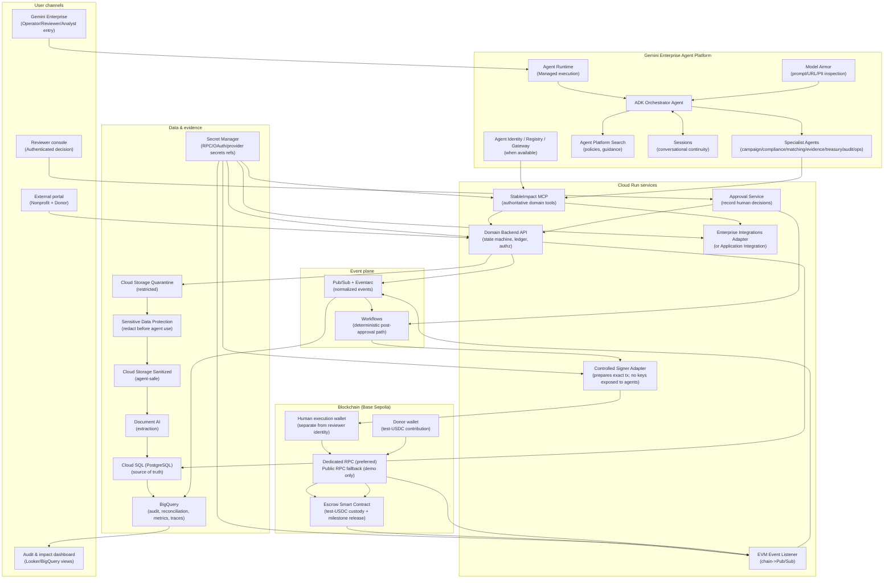

# StableImpact — Architecture (Roadmap-aligned)

Source document: `stableimpact-roadmap-google-cloud-enterprise-en.md`

This document contains:

- Target architecture overview
- Requirements (functional, non-functional, prohibitions)
- Dataflow diagrams (sequence diagrams)
- Agent specification (roles, tool access policy, safety constraints, evaluation criteria)

---

## 1) Target Architecture Diagram

