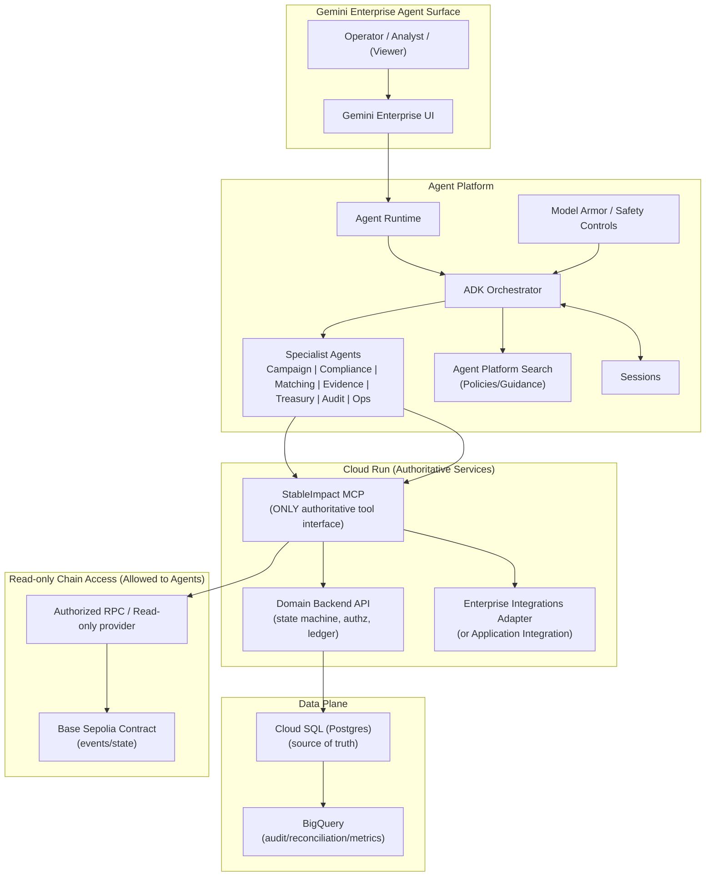
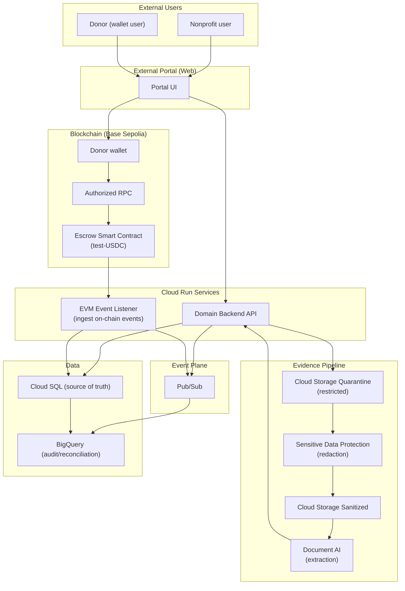
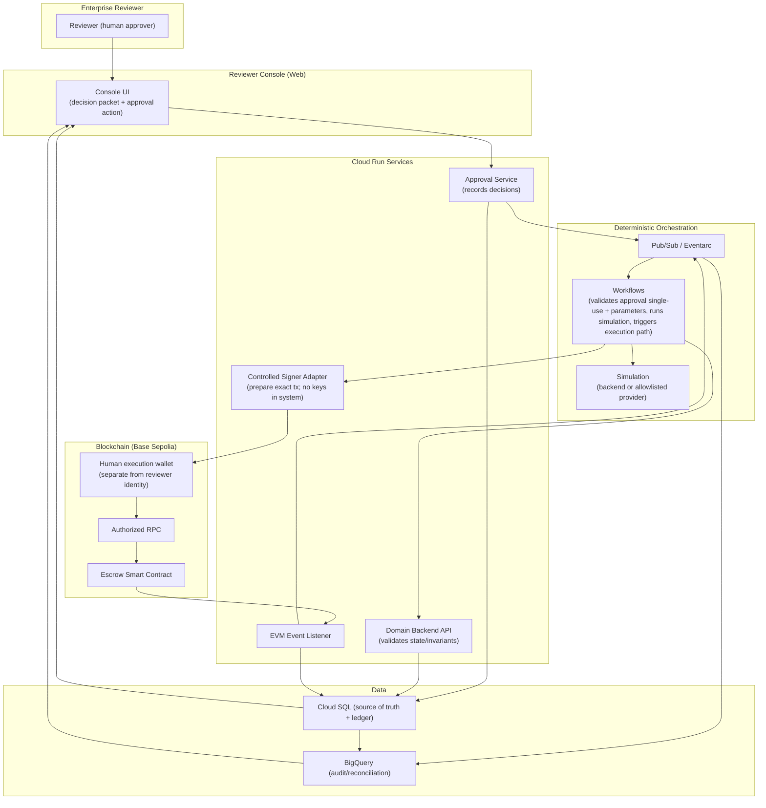
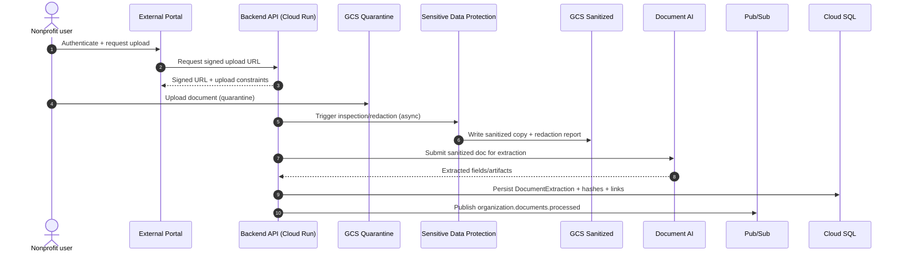
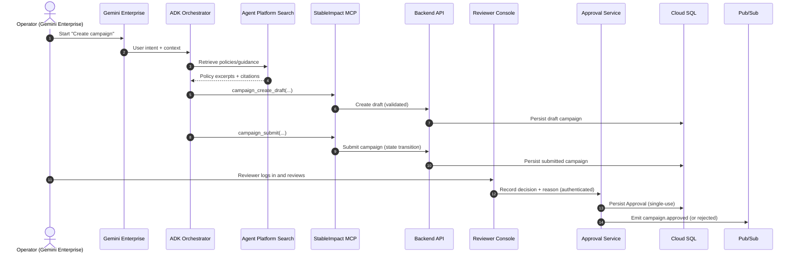
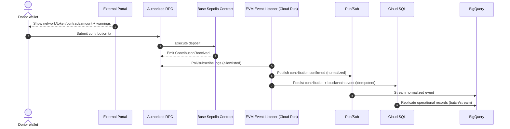
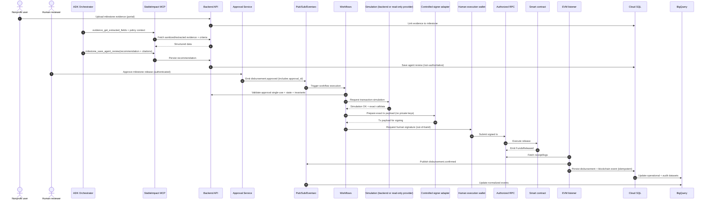

# StableImpact — Architecture (Roadmap-aligned)

Source document: `stableimpact-roadmap-google-cloud-enterprise-en.md`

This document contains:

- High-level architecture overview (3 surfaces + shared backbone)
- Three architecture diagrams:
  1. Agents (Gemini Enterprise + ADK)
  2. External Portal (Nonprofit + Donor)
  3. Reviewer Console (Authenticated human decisioning)
- Requirements split by surface: **External Portal (PR)**, **Agents (AR)**, **Reviewer Console (RR)**
- Explicit boundary: **Reviewer Console vs External Portal**
- Dataflow diagrams (sequence diagrams)
- Agent specification (roles, tool access policy, safety constraints, evaluation criteria)

---

## 1) High-level Architecture Overview

StableImpact is a three-surface system tied together by a private MCP and deterministic backend:

1. **Agents surface (Gemini Enterprise + ADK on Agent Runtime)**
   - Converts unstructured inputs into structured drafts, runs policy/risk/evidence reasoning, and produces **recommendations**.
   - Agents can only act through **StableImpact MCP** (domain tools).
   - Agents **never approve or sign**.

2. **External Portal surface (Nonprofit + Donor)**
   - Handles document uploads (signed URLs → quarantine → sanitize → extract).
   - Handles donor testnet contributions and shows **transaction proof**.
   - No approvals.

3. **Reviewer Console surface (Enterprise reviewer)**
   - The only place where **authenticated human approvals** are recorded.
   - Shows the “decision packet”: risk + evidence highlights + exact release parameters + simulation status.
   - Triggers deterministic orchestration (Pub/Sub/Eventarc → Workflows) that enforces single-use approvals and exact-parameter validation.

Shared backbone:

- **Cloud Run**: MCP, backend API, approval service, EVM listener, controlled signer adapter, integrations adapter
- **Cloud SQL**: authoritative state + append-only ledger
- **Cloud Storage + DLP + Document AI**: evidence pipeline (quarantine → sanitized → extracted fields)
- **Pub/Sub + Workflows**: deterministic execution path after approval
- **Base Sepolia contract + authorized RPC**: verifiable test-USDC contributions/releases
- **BigQuery**: reconciliation/audit/impact views

---

## 2) Architecture Diagrams

### 2.1 Agents Architecture (Gemini Enterprise + ADK)

**Key boundaries**

- Agents talk to the business system **only via MCP**.
- Any chain access from agents is **read-only** (state/tx/receipts/logs) and must be allowlisted.
- Agents must never approve, sign, execute, deploy, or access private keys.

---

### 2.2 External Portal Architecture (Nonprofit + Donor)

**Key boundaries**

- Portal supports uploads, status, and donor contributions.
- Portal must **not** be an approval or signing surface.

---

### 2.3 Reviewer Console Architecture (Authenticated approval)

**Key boundaries**

- Console is the **only** surface that can create approvals.
- Execution still requires deterministic workflow validation and a separate human execution wallet signature.

---

## 3) Requirements (split by surface)

### 3.0 Shared global requirements (applies to all surfaces)

**SGR-1 Demo boundary (mandatory)**

- Synthetic organizations/documents/wallets only.
- Testnet-only transactions (Base Sepolia primary).
- Test tokens have no real value; UI/docs must not imply real-funds capability.

**SGR-2 Human authority boundary**

- Agents may recommend; **humans approve**; Workflows enforces deterministic validation; **separate human wallet signs**.

**SGR-3 Security and secrets**

- No secrets in repo, prompts, logs, traces, datasets, or agent memory.
- Provider credentials stored in Secret Manager; only references appear in config.

**SGR-4 Idempotency and anti-duplication**

- All writes require idempotency keys; retries must not create duplicate approvals, events, or disbursements.

**SGR-5 Traceability**

- End-to-end correlation IDs: `trace_id`, `session_id`, `agent_run_id`, `user_id`, `organization_id`, `campaign_id`, `milestone_id`, `approval_id`, `workflow_execution_id`, `transaction_hash`.
- Audit must answer: who approved, what evidence, what amount, where to verify.

---

### 3.1 External Portal requirements (PR)

**PR-1 Authentication & role separation**

- Portal shall support authenticated nonprofit users (and donor session/wallet flow as applicable).
- Portal identities must be distinct from reviewer identities; portal cannot create “approval” records.

**PR-2 Signed uploads + quarantine**

- Portal shall request signed upload URLs and upload documents into a restricted Cloud Storage quarantine area.
- Portal shall enforce constraints: file type allowlist, size limits, clear error handling.

**PR-3 Evidence processing visibility**

- Portal shall display evidence processing status (uploaded → quarantined → sanitized → extracted → ready/failed).
- Portal shall never display raw quarantined content to agents or other users if policy forbids it.

**PR-4 Campaign and milestone context (read-only)**

- Portal shall show campaign milestones and required evidence checklists (as allowed by permissions).

**PR-5 Donor contribution flow (testnet)**

- Portal shall display network, chain ID, token, contract address, and amount with explicit “testnet-only” warnings.
- Portal shall guide wallet contribution submission and show transaction hash + explorer link after contribution.

**PR-6 Milestone evidence submission**

- Portal shall support uploading milestone evidence and linking it to `campaign_id` and `milestone_id`.
- Portal shall show that agent recommendations are pending vs reviewer decision pending.

**PR-7 Mock labeling**

- If any external provider results are mocked (KYC/KYB/sanctions/CRM/ERP), portal shall clearly label mocks and limitations.

**PR must NOT**

- Create or modify approvals.
- Trigger release execution or signing.
- Present agent recommendations as final decisions.

---

### 3.2 Agent requirements (AR)

**AR-1 Orchestration and delegation**

- Orchestrator routes intent, requests missing info, delegates tasks, and stops at human-decision boundaries.

**AR-2 Grounded policy retrieval**

- Agents retrieve policy and guidance from approved sources and cite sources.

**AR-3 Draft campaign creation via MCP**

- Agents create/update/submit campaign drafts using StableImpact MCP tools; backend validates and persists authoritative state.

**AR-4 Sanitized-only evidence consumption**

- Agents consume only sanitized content and Document AI extraction outputs; they do not access quarantined originals if policy forbids.

**AR-5 Risk and due diligence recommendation**

- Compliance agent evaluates versioned risk policy and produces explainable results with uncertainty and escalation.

**AR-6 Milestone evaluation recommendation**

- Evidence agent compares acceptance criteria, budgets, invoices, and verified transactions (read-only chain tools) and outputs a recommendation with citations.

**AR-7 Treasury proposal + simulation request**

- Treasury agent prepares disbursement proposals and requests simulation; cannot execute disbursement.

**AR-8 Audit narrative**

- Audit agent reconciles Cloud SQL with on-chain events and BigQuery views and generates an evidence-backed explanation.

**AR-9 Tooling constraints**

- Agents use StableImpact MCP domain tools only.
- External blockchain MCP is read-only/simulation-only and allowlisted.

**AR must NOT**

- Approve campaigns/disbursements.
- Sign transactions or access private keys/seed phrases.
- Deploy/modify contracts.
- Use generic blockchain write/sign tools.
- Treat model output as authoritative ledger or authoritative on-chain state.

---

### 3.3 Reviewer Console requirements (RR)

**RR-1 Strong authentication**

- Reviewer console requires authenticated access; records reviewer identity with each decision.

**RR-2 Decision context display (campaign and milestone)**
Before approval, console shows:

- campaign/milestone identifiers and state
- evidence list + extracted highlights (sanitized)
- risk assessment + cited policy context
- amount (integer base units), recipient, token, contract, chain ID/network
- agent recommendation labeled non-binding
- simulation status/result
- single-use approval notice

**RR-3 Decision capture**

- Approve/reject/request-info with reason.
- Creates a single-use `approval_id` bound to exact parameters.

**RR-4 Post-approval traceability**

- Shows workflow status and transaction hash + explorer link after execution.

**RR-5 Mock/testnet labeling**

- Clearly labels testnet assets and mocked provider outcomes.

**RR must NOT**

- Contain/access private keys.
- Allow parameter edits after approval without invalidating/re-issuing approval.
- Trigger execution without deterministic workflow validation.

---

### 3.4 Reviewer Console vs External Portal (explicit differences)

1. **Authority:** Portal submits; Console approves (authenticated).
2. **Audience:** Portal = nonprofit/donor; Console = enterprise reviewer.
3. **Information:** Portal = status/tx proof; Console = full decision packet + audit fields.
4. **Security posture:** Portal may be internet-facing; Console must be tightly access-controlled.
5. **Financial controls:** Portal cannot approve/execute; Console records approval, but execution requires Workflows + separate execution wallet signature.

---

## 4) Dataflow Diagrams

### 4.1 Organization onboarding + document processing

### 4.2 Campaign creation + approval

### 4.3 Contribution + event ingestion

### 4.4 Milestone evaluation + deterministic disbursement

---

## 5) Agent Specification

### 5.1 Agent roster and responsibilities

| Agent                            | Primary responsibilities                                                                                     | Must-not boundaries                           | Primary MCP tools                                                                                                       |
| -------------------------------- | ------------------------------------------------------------------------------------------------------------ | --------------------------------------------- | ----------------------------------------------------------------------------------------------------------------------- |
| Orchestrator                     | Routes intent, asks for missing fields, delegates, enforces “stop at human decision boundary”                | Must not approve or execute financial actions | All domain tools as needed; prefer delegating writes                                                                    |
| Program & Campaign Agent         | Draft campaigns, milestones, impact indicators; retrieve policy context; save drafts                         | Must not “auto-approve”                       | `campaign_create_draft`, `campaign_update_draft`, `campaign_submit`, `campaign_get_policy_context`                      |
| Compliance & Due-Diligence Agent | Review sanitized org data + extractions + integration results; produce risk assessment with uncertainty      | Must not change approval state                | `organization_get`, `organization_get_verification`, `compliance_run_checks`, `risk_get_policy`, `risk_save_assessment` |
| Matching Agent                   | Match campaigns to programs; explain alignment and risk                                                      | Must avoid investment language/returns        | `campaign_list_eligible`, `campaign_get_policy_context`                                                                 |
| Evidence & Impact Agent          | Compare milestone evidence to criteria/budget/invoices/on-chain facts; recommend approve/reject/request info | Must not execute disbursement                 | `evidence_get_*`, `chain_get_*`, `milestone_save_agent_review`                                                          |
| Treasury Agent                   | Prepare disbursement proposal; request simulation; explain amount/recipient/conditions                       | Must not approve/sign/execute                 | `chain_get_token_balance`, `chain_get_campaign_state`, `disbursement_create_proposal`, `disbursement_simulate`          |
| Audit Agent                      | Reconcile sources; detect discrepancies; generate audit dataset/report                                       | Must not mutate financial state               | `audit_get_campaign_ledger`, `audit_compare_sources`, `audit_generate_dataset`, `audit_save_report`                     |
| Operations Agent                 | Summarize health, failures, traces; recommend actions                                                        | Must not modify infrastructure                | `ops_get_service_health`, `ops_get_failed_events`, `ops_get_agent_trace`, `ops_prepare_incident_report`                 |

### 5.2 Tool access control policy (minimum tool allocation)

- Evidence & Impact Agent: **no** `disbursement_execute_approved`
- Treasury Agent: **no** `disbursement_execute_approved`; simulation only
- Orchestrator: may call write tools but should delegate; never request keys
- Only the deterministic Workflow path may lead to “execute-approved” after approval validation.

### 5.3 Shared safety constraints (prompts/callbacks)

- Refuse requests to: approve, sign, transfer, deploy, bypass approval, reveal secrets.
- Cite sources (policy, extracted fields, receipts) for all recommendations.
- Label testnet/mocks; avoid language implying real funds or returns.

### 5.4 Required evaluation criteria (thresholds)

- 0 payments without valid approval
- 0 secrets exposure
- 0 duplicate releases
- ≥90% correct tool choice in primary cases
- ≥90% grounded responses where evaluable
- All critical dataset attacks rejected (prompt injection, malicious docs, secret requests, financial-return promises)
