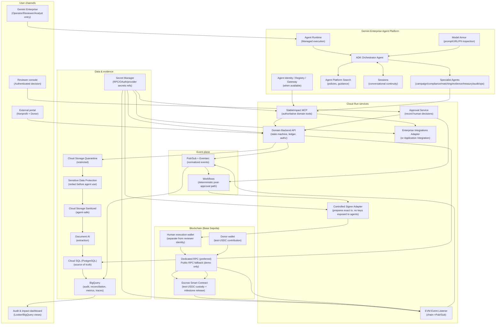
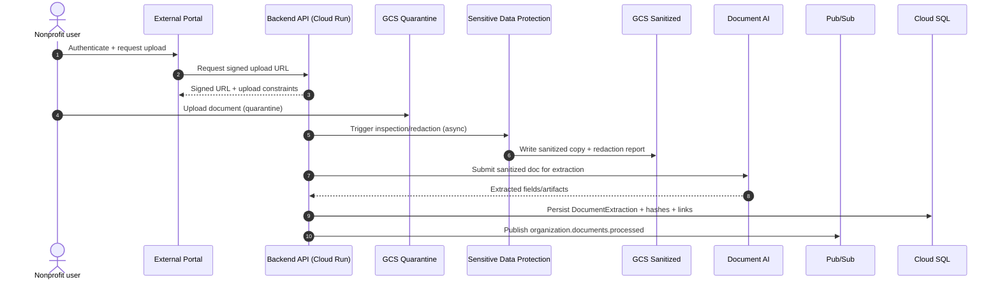
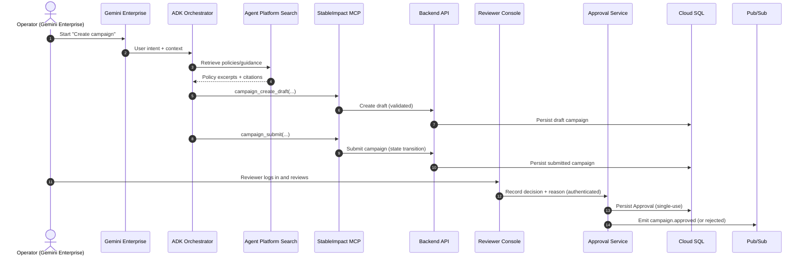
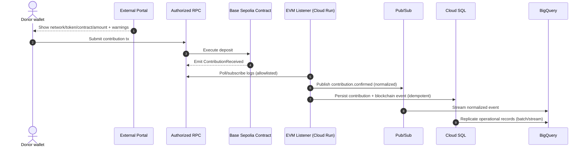
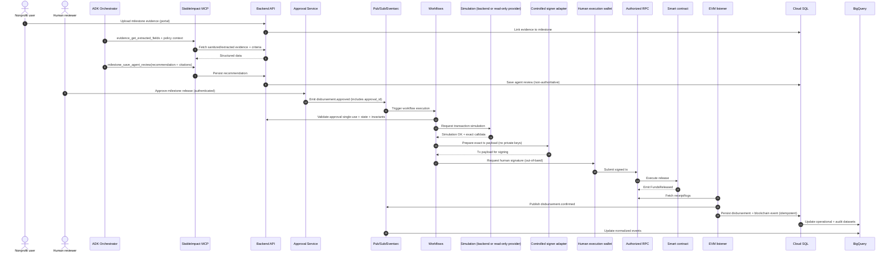

````markdown
# StableImpact — Architecture (Roadmap-aligned)

Source document: `stableimpact-roadmap-google-cloud-enterprise-en.md`

This document contains:

- Target architecture overview
- Requirements split by surface: **External Portal (PR)**, **Agents (AR)**, **Reviewer Console (RR)**
- Clear boundary: **Reviewer Console vs External Portal**
- Dataflow diagrams (sequence diagrams)
- Agent specification (roles, tool access policy, safety constraints, evaluation criteria)

---

## 1) Target Architecture Diagram


````

---

## 2) Requirements (split by surface)

### 2.0 Shared global requirements (applies to all surfaces)

**SGR-1 Demo boundary (mandatory)**

- Synthetic organizations/documents/wallets only.
- Testnet-only transactions (Base Sepolia primary).
- Test tokens have no real value; UI/docs must not imply real-funds capability.

**SGR-2 Human authority boundary**

- Agents may recommend; **humans approve**; Workflows enforces deterministic validation; **separate human wallet signs**.

**SGR-3 Security and secrets**

- No secrets in repo, prompts, logs, traces, datasets, or agent memory.
- Provider credentials stored in Secret Manager; only references appear in config.

**SGR-4 Idempotency and anti-duplication**

- All writes require idempotency keys; retries must not create duplicate approvals, events, or disbursements.

**SGR-5 Traceability**

- End-to-end correlation IDs: `trace_id`, `session_id`, `agent_run_id`, `user_id`, `organization_id`, `campaign_id`, `milestone_id`, `approval_id`, `workflow_execution_id`, `transaction_hash`.
- Audit must answer: who approved, what evidence, what amount, where to verify.

---

### 2.1 External Portal requirements (PR)

**Portal purpose:** Nonprofit + donor interface for submissions, uploads, and contributions; shows status and proofs. It is **not** an approval surface.

**PR-1 Authentication & role separation**

- Portal shall support authenticated nonprofit users (and donor session/wallet flow as applicable).
- Portal identities must be distinct from reviewer identities; portal cannot create “approval” records.

**PR-2 Signed uploads + quarantine**

- Portal shall request signed upload URLs and upload documents into a restricted Cloud Storage quarantine area.
- Portal shall enforce constraints: file type allowlist, size limits, clear error handling.

**PR-3 Evidence processing visibility**

- Portal shall display evidence processing status (uploaded → quarantined → sanitized → extracted → ready/failed).
- Portal shall never display raw quarantined content to agents or other users if policy forbids it.

**PR-4 Campaign and milestone context (read-only)**

- Portal shall show campaign milestones and required evidence checklists (as allowed by permissions).

**PR-5 Donor contribution flow (testnet)**

- Portal shall display **network, chain ID, token, contract address, and amount** with explicit “testnet-only” warnings.
- Portal shall guide wallet contribution submission and show transaction hash + explorer link after contribution.

**PR-6 Milestone evidence submission**

- Portal shall support uploading milestone evidence and linking it to `campaign_id` and `milestone_id`.
- Portal shall show that agent recommendations are pending vs reviewer decision pending.

**PR-7 Mock labeling**

- If any external provider results are mocked (KYC/KYB/sanctions/CRM/ERP), portal shall clearly label mocks and limitations.

**PR must NOT**

- Create or modify approvals.
- Trigger release execution or signing.
- Present agent recommendations as final decisions.

---

### 2.2 Agent requirements (AR)

**Agent purpose:** Structure data, interpret policies and evidence, and generate grounded recommendations through **StableImpact MCP** domain tools, without performing approvals or signing.

**AR-1 Orchestration and delegation**

- System shall implement an orchestrator agent that routes intent, requests missing info, delegates tasks, and stops at human-decision boundaries.

**AR-2 Grounded policy retrieval**

- Agents shall retrieve policy and guidance from approved sources (Agent Platform Search or controlled corpus) and cite sources.

**AR-3 Draft campaign creation via MCP**

- Agents shall create/update/submit campaign drafts using StableImpact MCP tools; backend validates and persists authoritative state.

**AR-4 Sanitized-only evidence consumption**

- Agents shall consume only sanitized content and Document AI extraction outputs.
- Agents shall not receive quarantined originals if policy forbids it.

**AR-5 Risk and due diligence recommendation**

- Compliance agent shall evaluate a versioned policy/risk matrix and produce explainable results, including uncertainty and escalation on ambiguous inputs.

**AR-6 Milestone evaluation recommendation**

- Evidence agent shall compare acceptance criteria, budgets, invoices, and verified transactions (read-only chain tools) and output:
  - approve/reject/request-info recommendation
  - citations and uncertainty notes
- Agent output must be recorded as non-authoritative evidence (not a state transition).

**AR-7 Treasury proposal + simulation request (no execution)**

- Treasury agent shall prepare disbursement proposals and request simulation via domain tools, but cannot execute disbursement.

**AR-8 Audit narrative**

- Audit agent shall reconcile Cloud SQL state with on-chain events and BigQuery views and generate an evidence-backed explanation (who/what/why/where to verify).

**AR-9 Tooling constraints (critical)**

- Agents shall use StableImpact MCP domain tools only.
- External blockchain MCP (e.g., Alchemy MCP) shall be read-only/simulation-only and allowlisted.

**AR must NOT**

- Approve campaigns/disbursements.
- Sign transactions or access private keys/seed phrases.
- Deploy/modify contracts.
- Use generic blockchain write/sign tools (`sendTokens`, `writeContract`, `sendTransactions`, `signMessage`, etc.).
- Treat model output as authoritative ledger or authoritative on-chain state.

---

### 2.3 Reviewer Console requirements (RR)

**Reviewer Console purpose:** The authenticated **human decision** surface. It must present complete decision context and record auditable approvals.

**RR-1 Strong authentication**

- Reviewer console shall require authenticated access and record reviewer identity with every decision.

**RR-2 Decision context display (campaign and milestone)**
Before a reviewer approves a campaign or milestone release, the console shall display, at minimum:

- campaign and milestone identifiers and current state
- evidence list and extracted highlights (sanitized)
- risk assessment summary and cited policy context
- amount (integer base units), recipient, token, contract address, chain ID/network
- agent recommendation clearly labeled “non-binding”
- simulation status/result (success/failure summary)
- explicit single-use approval notice (“approval will be consumed; reuse will be rejected”)

**RR-3 Decision capture**

- Console shall allow approve/reject/request-info (or approve/request-changes) with reason.
- Decision shall create a single-use `approval_id` bound to exact parameters (campaign_id, milestone_id, amount, recipient, token, contract, chain_id).

**RR-4 Post-approval traceability**

- Console shall display deterministic workflow status and, after execution, the transaction hash + explorer link.

**RR-5 Mock/testnet labeling**

- Console shall clearly label testnet assets and any mocked external provider outcomes and limitations.

**RR must NOT**

- Contain or access private keys.
- Allow post-approval parameter edits without invalidating/re-issuing approval.
- Trigger “execution” directly without deterministic workflow validation.

---

### 2.4 Reviewer Console vs External Portal (explicit differences)

1. **Authority**
   - **Portal:** submission + transparency; no approval power.
   - **Reviewer Console:** exclusive surface for recording authenticated approvals that enable deterministic disbursement.

2. **Audience**
   - **Portal:** nonprofit applicants and donors.
   - **Reviewer Console:** enterprise reviewer/operator accountable for decisions.

3. **Minimum information shown**
   - **Portal:** user-facing status, evidence upload UX, donor contribution UX, transaction proof.
   - **Reviewer Console:** complete decision packet (risk + policy context + evidence highlights + exact release parameters + simulation + audit fields).

4. **Security posture**
   - **Portal:** may be internet-facing; must enforce strict input limits, CORS, and hardened endpoints.
   - **Reviewer Console:** must be tightly access-controlled; reviewer identity becomes an audit artifact.

5. **Financial controls**
   - **Portal:** cannot approve or execute.
   - **Reviewer Console:** records approval; execution still requires deterministic workflow + separate human execution wallet signature.

---

## 3) Dataflow Diagrams

### 3.1 Organization onboarding + document processing



### 3.2 Campaign creation + approval



### 3.3 Contribution + event ingestion



### 3.4 Milestone evaluation + deterministic disbursement



---

## 4) Agent Specification

### 4.1 Agent roster and responsibilities

| Agent                            | Primary responsibilities                                                                                     | Must-not boundaries                           | Primary MCP tools                                                                                                       |
| -------------------------------- | ------------------------------------------------------------------------------------------------------------ | --------------------------------------------- | ----------------------------------------------------------------------------------------------------------------------- |
| Orchestrator                     | Routes intent, asks for missing fields, delegates, enforces “stop at human decision boundary”                | Must not approve or execute financial actions | All domain tools as needed; prefer delegating writes                                                                    |
| Program & Campaign Agent         | Draft campaigns, milestones, impact indicators; retrieve policy context; save drafts                         | Must not “auto-approve”                       | `campaign_create_draft`, `campaign_update_draft`, `campaign_submit`, `campaign_get_policy_context`                      |
| Compliance & Due-Diligence Agent | Review sanitized org data + extractions + integration results; produce risk assessment with uncertainty      | Must not change approval state                | `organization_get`, `organization_get_verification`, `compliance_run_checks`, `risk_get_policy`, `risk_save_assessment` |
| Matching Agent                   | Match campaigns to programs; explain alignment and risk                                                      | Must avoid investment language/returns        | `campaign_list_eligible`, `campaign_get_policy_context`                                                                 |
| Evidence & Impact Agent          | Compare milestone evidence to criteria/budget/invoices/on-chain facts; recommend approve/reject/request info | Must not execute disbursement                 | `evidence_get_*`, `chain_get_*`, `milestone_save_agent_review`                                                          |
| Treasury Agent                   | Prepare disbursement proposal; request simulation; explain amount/recipient/conditions                       | Must not approve/sign/execute                 | `chain_get_token_balance`, `chain_get_campaign_state`, `disbursement_create_proposal`, `disbursement_simulate`          |
| Audit Agent                      | Reconcile sources; detect discrepancies; generate audit dataset/report                                       | Must not mutate financial state               | `audit_get_campaign_ledger`, `audit_compare_sources`, `audit_generate_dataset`, `audit_save_report`                     |
| Operations Agent                 | Summarize health, failures, traces; recommend actions                                                        | Must not modify infrastructure                | `ops_get_service_health`, `ops_get_failed_events`, `ops_get_agent_trace`, `ops_prepare_incident_report`                 |

### 4.2 Tool access control policy (minimum tool allocation)

- Evidence & Impact Agent: **no** `disbursement_execute_approved`
- Treasury Agent: **no** `disbursement_execute_approved`; simulation only
- Orchestrator: may call write tools but should delegate; never request keys
- Only the deterministic Workflow path may lead to “execute-approved” after approval validation.

### 4.3 Shared safety constraints (prompts/callbacks)

- Refuse requests to: approve, sign, transfer, deploy, bypass approval, reveal secrets.
- Cite sources (policy, extracted fields, receipts) for all recommendations.
- Label testnet/mocks; avoid language implying real funds or returns.

### 4.4 Required evaluation criteria (thresholds)

- 0 payments without valid approval
- 0 secrets exposure
- 0 duplicate releases
- ≥90% correct tool choice in primary cases
- ≥90% grounded responses where evaluable
- All critical dataset attacks rejected (prompt injection, malicious docs, secret requests, financial-return promises)
