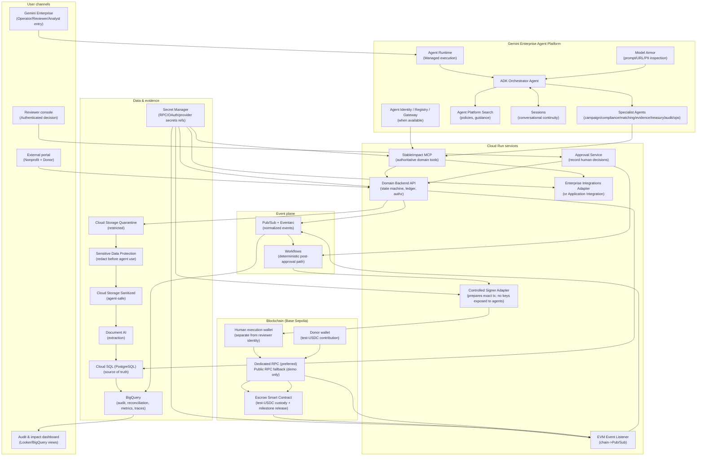
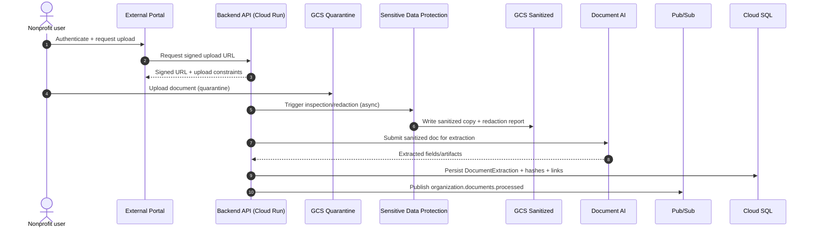
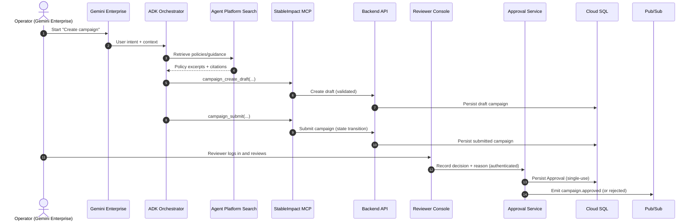
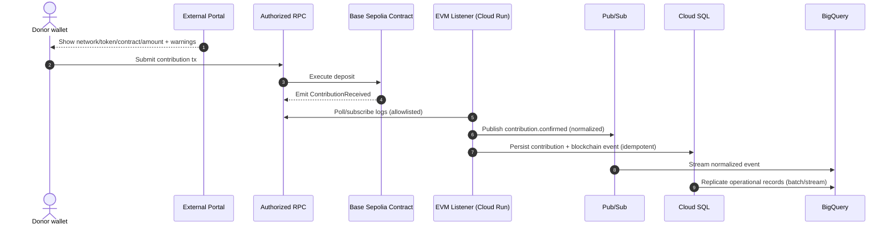
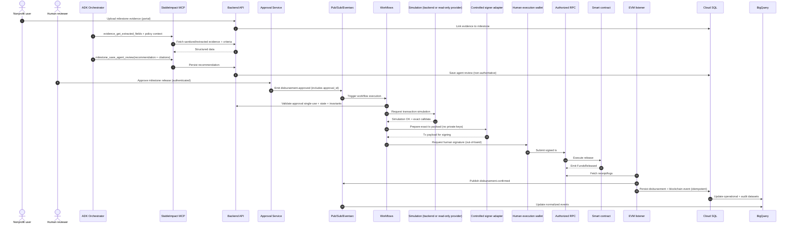

I can’t directly write to your GitHub repo from this chat, but I can give you a **ready-to-commit `architecture.md`** and the exact steps to add it to `https://github.com/eweinmanepam/Documents`.

## How to save it into your repo (quick steps)

1. Open: `https://github.com/eweinmanepam/Documents`
2. Click **Add file → Create new file**
3. In **Filename**, enter: `architecture.md`
4. Paste the Markdown content below
5. Click **Commit changes**

---

# `architecture.md` (paste this entire content)

````markdown
# StableImpact — Architecture (Roadmap-aligned)

Source document: `stableimpact-roadmap-google-cloud-enterprise-en.md`

This document contains:

- Target architecture overview
- Requirements (functional, non-functional, prohibitions)
- Dataflow diagrams (sequence diagrams)
- Agent specification (roles, tool access policy, safety constraints, evaluation criteria)

---

## 1) Target Architecture Diagram


````

---

## 2) Requirements

### 2.1 Functional requirements (FR)

**FR-1 Campaign creation (Gemini Enterprise + MCP)**

- System shall allow an operator to create a structured campaign via Gemini Enterprise, with agent-assisted collection of missing info.
- System shall persist drafts and final submissions through StableImpact MCP domain tools.

**FR-2 Document intake + sanitization**

- System shall provide signed upload URLs and quarantine incoming documents.
- System shall sanitize documents using Sensitive Data Protection (or explicitly documented equivalent) before any agent consumption.

**FR-3 Document extraction**

- System shall extract structured fields via Document AI (OCR/forms/invoices) and store results linked to organization/campaign/milestone.

**FR-4 Compliance/risk recommendation**

- System shall run policy checks and produce an evidence-cited risk assessment with uncertainty handling.

**FR-5 Contribution intake (Base Sepolia)**

- System shall display network/token/contract and allow a donor to contribute test-USDC.
- System shall ingest `ContributionReceived` events via an EVM listener and persist idempotently.

**FR-6 Milestone evidence evaluation**

- System shall accept milestone evidence uploads, sanitize and extract them, and produce a grounded recommendation (approve/reject/request info).

**FR-7 Human approval (mandatory)**

- System shall provide an authenticated reviewer console to record decisions.
- System shall treat approval as **single-use** and bind it to campaign+milestone+amount+recipient+token+contract+chain_id.

**FR-8 Deterministic disbursement**

- System shall use Workflows to validate deterministic rules, request simulation, and only then trigger controlled execution.

**FR-9 Controlled signing**

- System shall require a separate human execution wallet to sign the exact approved transaction.
- System shall ensure agents never receive private keys or generic signing capability.

**FR-10 Reconciliation + audit explanation**

- System shall reconcile Cloud SQL state and on-chain events in BigQuery.
- System shall produce an audit/impact explanation answering: who approved, what evidence, what amount, where to verify.

**FR-11 Enterprise integration (at least one visible)**

- System shall implement at least one real enterprise integration, or a contract-compatible mock clearly labeled.

### 2.2 Non-functional requirements (NFR)

- **NFR-1 Security/IAM:** least privilege, separate identities, private Cloud Run by default.
- **NFR-2 Data protection:** no secrets in repo/logs/prompts/datasets/traces; Secret Manager references only.
- **NFR-3 Traceability:** end-to-end correlation IDs: `trace_id, session_id, agent_run_id, campaign_id, milestone_id, approval_id, workflow_execution_id, transaction_hash`, etc.
- **NFR-4 Idempotency:** all write operations require idempotency keys; retries must not create duplicates.
- **NFR-5 Observability:** structured logs, traces, alerts for failures/rejections/reconciliation differences; exclude full prompts/docs unless explicitly approved.
- **NFR-6 Reliability:** core path must survive auxiliary MCP failure if authorized RPC remains available.
- **NFR-7 Demo boundary:** synthetic data only; testnet only; mock labeling enforced.

### 2.3 Explicit prohibitions (“must-not”)

- Agents must not approve disbursements, sign transactions, deploy contracts, or execute arbitrary SQL/shell.
- MCP must not expose generic blockchain write tools (`sendTokens`, `writeContract`, `sendTransactions`, etc.).

---

## 3) Dataflow Diagrams

### 3.1 Organization onboarding + document processing



### 3.2 Campaign creation + approval



### 3.3 Contribution + event ingestion



### 3.4 Milestone evaluation + deterministic disbursement



---

## 4) Agent Specification

### 4.1 Agent roster and responsibilities

| Agent                            | Primary responsibilities                                                                                     | Must-not boundaries                           | Primary MCP tools                                                                                                       |
| -------------------------------- | ------------------------------------------------------------------------------------------------------------ | --------------------------------------------- | ----------------------------------------------------------------------------------------------------------------------- |
| Orchestrator                     | Routes intent, asks for missing fields, delegates, enforces “stop at human decision boundary”                | Must not approve or execute financial actions | All domain tools as needed; prefer delegating writes                                                                    |
| Program & Campaign Agent         | Draft campaigns, milestones, impact indicators; retrieve policy context; save drafts                         | Must not “auto-approve”                       | `campaign_create_draft`, `campaign_update_draft`, `campaign_submit`, `campaign_get_policy_context`                      |
| Compliance & Due-Diligence Agent | Review sanitized org data + extractions + integration results; produce risk assessment with uncertainty      | Must not change approval state                | `organization_get`, `organization_get_verification`, `compliance_run_checks`, `risk_get_policy`, `risk_save_assessment` |
| Matching Agent                   | Match campaigns to programs; explain alignment and risk                                                      | Must avoid investment language/returns        | `campaign_list_eligible`, `campaign_get_policy_context`                                                                 |
| Evidence & Impact Agent          | Compare milestone evidence to criteria/budget/invoices/on-chain facts; recommend approve/reject/request info | Must not execute disbursement                 | `evidence_get_*`, `chain_get_*`, `milestone_save_agent_review`                                                          |
| Treasury Agent                   | Prepare disbursement proposal; request simulation; explain amount/recipient/conditions                       | Must not approve/sign/execute                 | `chain_get_token_balance`, `chain_get_campaign_state`, `disbursement_create_proposal`, `disbursement_simulate`          |
| Audit Agent                      | Reconcile sources; detect discrepancies; generate audit dataset/report                                       | Must not mutate financial state               | `audit_get_campaign_ledger`, `audit_compare_sources`, `audit_generate_dataset`, `audit_save_report`                     |
| Operations Agent                 | Summarize health, failures, traces; recommend actions                                                        | Must not modify infrastructure                | `ops_get_service_health`, `ops_get_failed_events`, `ops_get_agent_trace`, `ops_prepare_incident_report`                 |

### 4.2 Tool access control policy (minimum tool allocation)

- Evidence & Impact Agent: **no** `disbursement_execute_approved`
- Treasury Agent: **no** `disbursement_execute_approved`; simulation only
- Orchestrator: may call write tools but should delegate; never request keys
- Only the deterministic Workflow path may lead to “execute-approved” after approval validation.

### 4.3 Shared safety constraints (prompts/callbacks)

- Refuse requests to: approve, sign, transfer, deploy, bypass approval, reveal secrets.
- Cite sources (policy, extracted fields, receipts) for all recommendations.
- Label testnet/mocks; avoid language implying real funds or returns.

### 4.4 Required evaluation criteria (thresholds)

- 0 payments without valid approval
- 0 secrets exposure
- 0 duplicate releases
- ≥90% correct tool choice in primary cases
- ≥90% grounded responses where evaluable
- All critical dataset attacks rejected (prompt injection, malicious docs, secret requests, financial-return promises)

```

If you’d like, I can also generate a short `README.md` snippet explaining how to render Mermaid diagrams on GitHub (and alternatives if GitHub doesn’t render them in your view).
```
