# Design Document: StableImpact

_Drafted 2026-08-28._

## Application Description

StableImpact is an agentic funding and impact-assurance platform for organizations that
manage grants, donations, corporate social responsibility programs, humanitarian
funding, or international development programs. Gemini-based agents structure funding
applications, review policy and evidence, assess risk, and recommend milestone-based
disbursements, but a human always makes the actual approval decision. Once a decision is
recorded, deterministic Google Cloud workflows execute it, and a Base Sepolia smart
contract provides a verifiable (testnet) record of the USDC contribution or release. The
platform's job is to connect funding decisions, evidence, approvals, payments,
reconciliation, and impact reporting into one traceable lifecycle, rather than leaving
them scattered across disconnected systems.

Several distinct kinds of users interact with the platform. **Beneficiary
organizations** (nonprofits, grantees) apply for funding, submitting organizational
documents, a budget, and an impact plan, and later submit evidence against individual
milestones. **Donors/funders** contribute test USDC to a campaign. **Business reviewers**
— authenticated humans — review the agents' risk and evidence recommendations and record
the actual approve/reject decision for both campaigns and disbursements; a separate
**execution wallet holder** signs the on-chain release itself, only after that decision
has passed deterministic validation, and is treated as a distinct piece of evidence even
when the same person holds both roles. **Auditors and operators** consume reconciliation
and impact reporting without acting inside the flow. Finally, the **Gemini/ADK agents**
themselves — an orchestrator plus specialists for compliance, matching, evidence/impact,
treasury, audit, and operations — are a distinct actor class: they read, recommend, and
explain, but they never approve, sign, or execute anything themselves.

## Architecture

### High-level system architecture

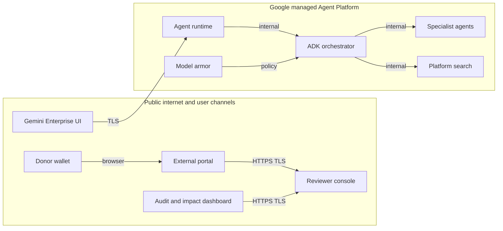

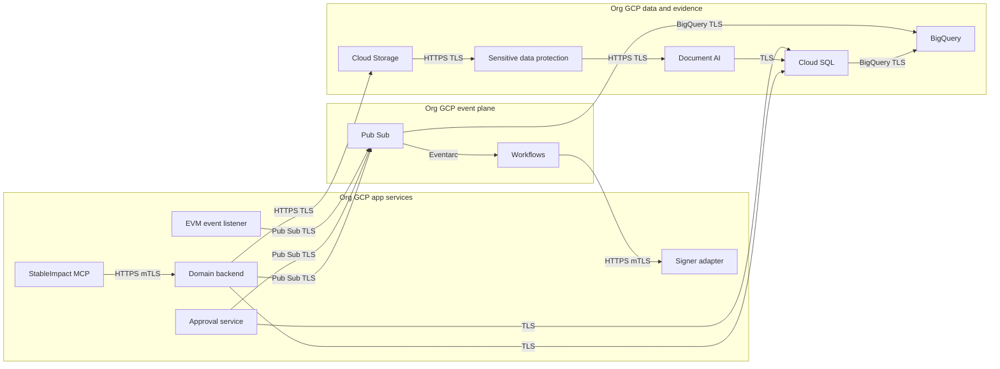

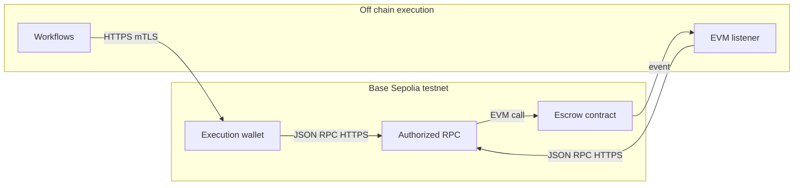

### Portal

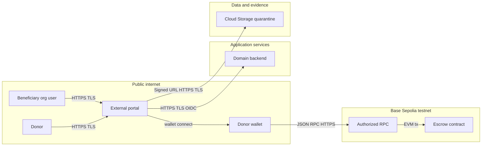

The portal never touches a private key — the donor's own wallet signs and submits the
contribution directly to the chain. The portal only assembles and displays the
transaction parameters, then later reads back confirmed contribution state from the
backend once the listener has ingested the on-chain event.

### Reviewer console

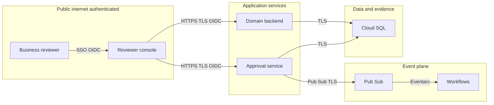

The console only records the business decision — it never signs a blockchain
transaction. The execution wallet is invoked separately, from Workflows, only after
deterministic validation has passed.

### Agents

Tool-to-agent mappings below are inferred from each agent's responsibility description
in the source roadmap and the roadmap's flat MCP tool catalog, since the source material
does not explicitly assign tools to agents. Confidence is lowest for the **Matching**
agent, whose tool set is not clued by the source text at all; see Open Questions.

**Orchestrator agent** — calls no MCP tools directly; it routes intent and delegates to
specialists.

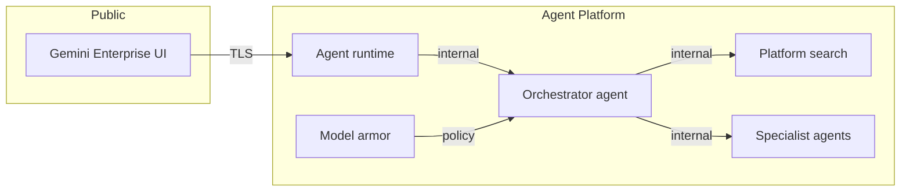

**Program & campaign agent**

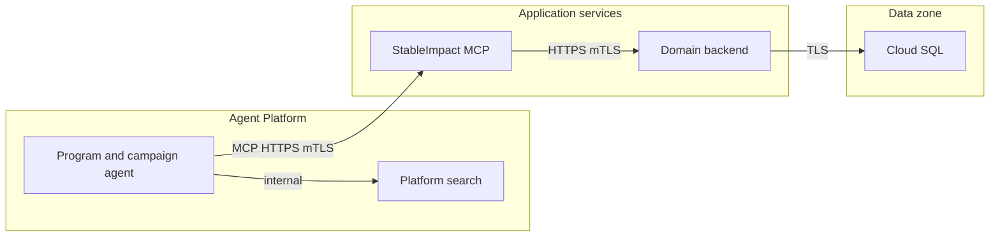

**Compliance & due-diligence agent**

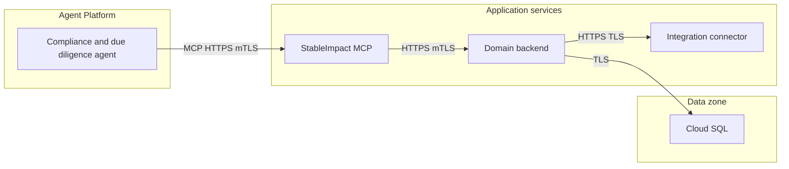

**Matching agent** _(lowest-confidence tool inference — see Open Questions)_

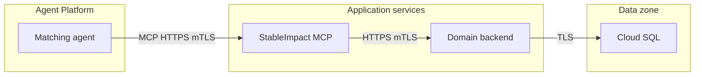

**Evidence & impact agent**

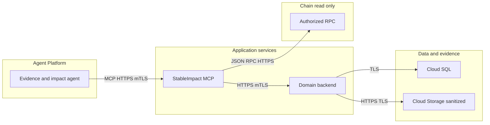

**Treasury agent** — has no access to `disbursement_execute_approved`; execution is
invoked only from Workflows after a valid human decision, per the MCP rules.

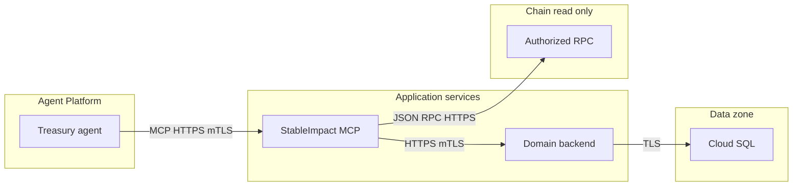

**Audit agent**

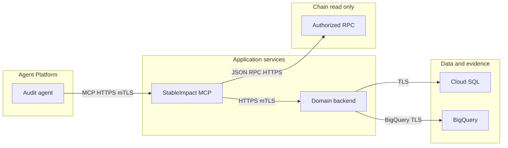

**Operations agent**

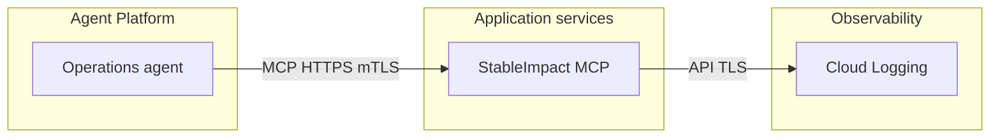

### Orchestrator delegation workflow

The diagram below shows how the orchestrator sequences work across specialists over a
full campaign lifecycle, and — critically — where it stops for a human decision rather
than carrying a request across an approval gate itself.

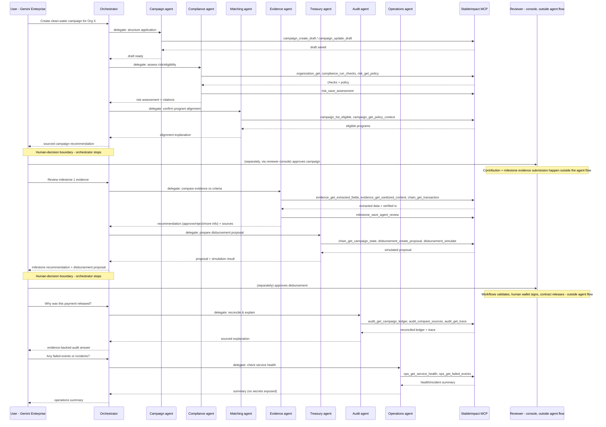

## Requirements / Use Cases

### Use Case 1: Organization onboarding

An organization applying for funding for the first time must be identified and screened
before any campaign work begins. A **beneficiary organization user** authenticates
(account provisioning itself is out of scope for this use case — see Assumptions and
Constraints, and the related Open Question), then submits identifying and organizational
documents through the **portal**. Those documents are quarantined, inspected and redacted
by **Sensitive Data Protection**, and structured by **Document AI**, so that only
sanitized, structured data ever reaches an agent. The **compliance agent** reads that
sanitized case file, runs KYC/KYB and sanctions checks against a real provider or a
clearly labeled mock, and produces a sourced risk summary. A **human reviewer** then
makes the actual onboarding decision — the agent never decides admission on its own.

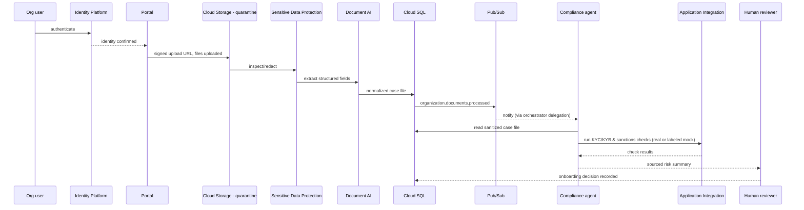

### Use Case 2: Campaign creation and approval

Once onboarded, an organization works with **Gemini Enterprise** to turn a funding need
into a structured campaign. The **program & campaign agent** retrieves the applicable
eligibility policy from **Agent Platform Search**, drafts the campaign through the MCP
server, and the **domain backend** validates its objectives, budget, milestones, and
amounts before anything is presented for approval. The campaign and compliance agents
jointly produce a sourced recommendation, and a **human reviewer** either approves the
campaign or sends it back for changes — the backend then records that decision and
publishes it as an event other components can react to.

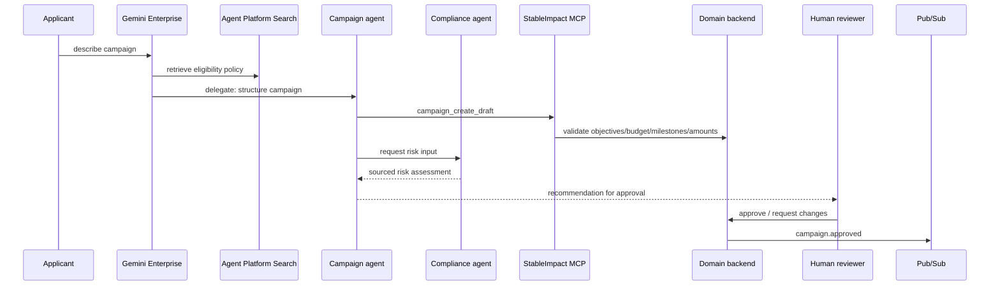

### Use Case 3: Test-USDC contribution

A **donor** funds an approved campaign directly on-chain. The portal shows the donor the
exact network, token, contract, and amount before anything is signed, then the donor's
own wallet signs and submits the contribution — the platform never holds the donor's
key. The **EVM listener** watches the Base Sepolia contract, confirms the event actually
belongs to the expected chain, contract, and block, and only then lets the contribution
enter the system of record, where it is recorded exactly once even if the underlying
blockchain event is redelivered.

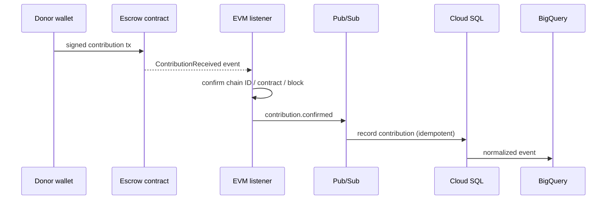

### Use Case 4: Milestone evaluation

Once a campaign is underway, the organization submits evidence that a funded milestone
was actually met. The document pipeline preserves the original submission while
producing a sanitized, structured version for agent consumption. The **evidence & impact
agent** retrieves the approved acceptance criteria for that milestone and compares the
submitted evidence against the criteria, the campaign's budget, invoices, and the
verified on-chain contribution — producing a sourced recommendation rather than an
unexplained score. The backend turns that recommendation into a concrete disbursement
proposal, which a **human reviewer** then evaluates in the reviewer console.

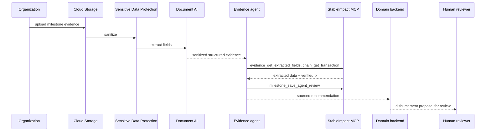

### Use Case 5: Disbursement

This use case is the deterministic execution of a decision a human has already made —
no agent participates in it. Once the **approval service** records the reviewer's
decision, an event activates **Workflows**, which independently re-validates that the
approval hasn't been used before, and that the milestone, amount, recipient, token, and
contract all match what was actually approved. Only after that validation and a
transaction simulation does the **human execution wallet** sign the exact approved call;
the contract's release event is then picked up by the listener and reconciled into both
the operational database and the analytics warehouse. A milestone can never be released
twice, and the released amount must exactly match what was approved.

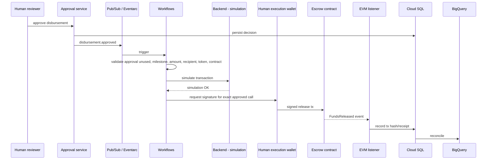

### Use Case 6: Reconciliation

Independent of any single campaign action, the **audit agent** periodically (or on
request) cross-checks the platform's own claims against reality: it compares the
internal ledger against contract events, approvals, contributions, releases, and
refunds, looking for discrepancies rather than assuming the ledger is correct by
construction. Its findings, along with their sources, are published as a dataset in
BigQuery, which feeds the audit and impact dashboard that auditors and operators use.

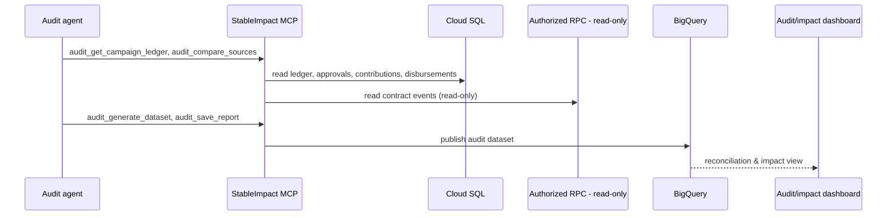

## Data Model

```mermaid
erDiagram
  ORGANIZATION ||--o{ CAMPAIGN : submits
  CAMPAIGN ||--o{ MILESTONE : defines
  MILESTONE ||--o{ EVIDENCE : receives
  EVIDENCE ||--o{ DOCUMENT_EXTRACTION : produces
  ORGANIZATION ||--o{ RISK_ASSESSMENT : assessed_by
  CAMPAIGN ||--o{ CONTRIBUTION : receives
  MILESTONE ||--o| DISBURSEMENT_PROPOSAL : generates
  DISBURSEMENT_PROPOSAL ||--|| APPROVAL : requires
  APPROVAL ||--o| DISBURSEMENT : authorizes
  CONTRIBUTION ||--|| BLOCKCHAIN_EVENT : confirmed_by
  DISBURSEMENT ||--|| BLOCKCHAIN_EVENT : confirmed_by
  CAMPAIGN ||--o{ IMPACT_METRIC : tracks
  CAMPAIGN ||--o{ AUDIT_EVENT : reconciled_via
  CAMPAIGN ||--o{ AGENT_RUN : analyzed_by
  ORGANIZATION ||--o{ INTEGRATION_EVENT : verified_via
```

Core entities, per the roadmap's minimum data model: `User`, `Organization`,
`FundingProgram`, `Campaign`, `Milestone`, `Evidence`, `DocumentExtraction`,
`RiskAssessment`, `Contribution`, `Approval`, `DisbursementProposal`, `Disbursement`,
`BlockchainEvent`, `ImpactMetric`, `AuditEvent`, `AgentRun`, `IntegrationEvent`.

Rules that apply across all of these:

- Financial records (`Contribution`, `Disbursement`) use immutable identifiers and are
  append-only — they are never mutated in place, only added to.
- Token amounts are stored as integer base units, never floating point, to avoid
  rounding drift against the on-chain amounts they must match exactly.
- `Approval` is single-use: once consumed by a `Disbursement`, it cannot authorize
  another one — this is what Workflows checks before signing.
- The backend validates every state transition; no table is written to directly by an
  agent or an external caller without passing through backend validation.
- `BlockchainEvent` always carries chain ID, token, contract address, block, and
  transaction hash, so it can be independently re-verified against the chain.
- `AgentRun` preserves the model ID, prompt version, sources cited, and trace ID for
  every agent recommendation, so a recommendation can be explained after the fact.
- `Evidence`/`DocumentExtraction` preserve hashes of both the original and sanitized
  versions of a document, so redaction can be audited without re-exposing the original.

## Security / Threat Considerations

**Identity and access.** Each component (MCP, backend, approval service, listener,
signer adapter) runs under its own least-privilege service identity; Cloud Run services
are private by default. Deployment access and runtime access are kept separate, and any
IAM change requires human approval — there is no path by which an agent or an automated
process can grant itself broader permissions.

**Agent and MCP restrictions.** StableImpact MCP is the only authoritative interface for
business operations; agents never call enterprise systems directly with shared
credentials. The MCP server enforces strict JSON Schema validation and rejects unknown
fields, authorizes every call by tool, identity, and resource, and requires idempotency
keys on writes. Critically, no MCP tool exposes generic transaction signing, token
transfer, contract deployment, or a generic write method — `disbursement_execute_approved`
is the only financial-execution tool, and it is only reachable after a valid human
approval exists; agents themselves have no private-key access at any point. Third-party
blockchain MCP tools (e.g. Alchemy) are restricted to an explicit read-only allowlist.

**AI and document security.** Model Armor inspects prompts, responses, and (where
supported) intermediate payloads for prompt injection, jailbreak attempts, and malicious
URLs, backstopped by application-level callbacks where platform coverage is incomplete.
Uploaded documents are quarantined, type- and size-restricted, and scanned before
Sensitive Data Protection redacts them — agents only ever see the sanitized, structured
output of that pipeline, never the raw upload.

**Secrets.** RPC endpoints, OAuth credentials, and provider credentials live in Secret
Manager; no secret is ever versioned into the repository, logs, prompts, traces, or
evaluation datasets, and sensitive MCP URLs/OAuth parameters are redacted wherever they
would otherwise appear in output.

**Wallet and signing separation.** At least two testnet wallets are required — a
deployment wallet (deploys the contract, assigns initial roles) and a separate execution
wallet (signs only approved releases). No wallet holds real assets, no seed phrase or
private key ever enters the repository, prompts, logs, database, analytics, or agent
memory, and the reviewer's identity is treated as distinct evidence from the execution
wallet's signature even when the same person controls both.

**Smart contract invariants.** A milestone cannot be released twice; released plus
refunded amounts can never exceed deposits; the released amount must exactly match the
approved milestone amount; only the `DISBURSEMENT_EXECUTOR_ROLE` may execute a release;
a paused campaign cannot release funds; a failed token transfer cannot leave behind
successful state; every event carries the immutable identifiers reconciliation depends
on.

**Application-level controls.** Restrictive CORS, correct token audience validation,
replay protection, idempotency on writes, and append-only audit records apply
throughout; public-facing endpoints sit behind Cloud Armor.

**Production/regulatory boundary.** Everything above is scoped to a demonstration using
synthetic organizations, documents, wallets, and testnet assets. The roadmap explicitly
does not claim authorization to process real funds — a real-funds launch would require
defined launch jurisdictions, legal review (crowdfunding, stablecoins, money
transmission, consumer protection, tax, privacy), production KYC/KYB and sanctions
screening, a custody/segregation-of-funds policy, dispute/refund/recovery processes, an
independent assessment of the contract and signing service, incident response and
continuity planning, and explicit data retention/residency decisions. None of that is
in scope for the current design.

## Deployment (Infrastructure as Code)

All cloud infrastructure is defined in Terraform and deployed through a reviewed,
repeatable pipeline rather than created by hand:

- **Provisioning.** Terraform defines every cloud resource — Cloud Run services, Cloud
  SQL instance, Cloud Storage buckets, Pub/Sub topics, Workflows definitions, BigQuery
  datasets, Secret Manager entries (created empty, populated out-of-band), and the
  per-component service accounts and their least-privilege IAM bindings. No cloud
  resource, IAM change, or API enablement is applied without an explicit human approval
  step first.
- **Application services** (StableImpact MCP, domain backend, approval service, EVM
  listener, controlled signer adapter) are each deployed as their own Cloud Run service,
  built and pushed through **Cloud Build** into **Artifact Registry**, so every deployed
  artifact is reproducible from source rather than hand-built.
- **Agent deployment** goes through the official `agents-cli scaffold` tooling into
  **Agent Runtime**, then is registered with **Gemini Enterprise** — this path is kept
  separate from the Terraform-managed application infrastructure, since it is governed
  by the Agent Platform's own deployment tooling.
- **Environments.** The roadmap targets a single demonstration environment against the
  Base Sepolia testnet; it does not define separate staging/production environments or
  a promotion pipeline between them — see Open Questions.
- **Deployment sequencing** follows the roadmap's phased plan: cloud foundation
  (Terraform, IAM, empty secrets) before agent scaffolding, before domain data, before
  the blockchain/signing path, before the MCP server and agents themselves, with human
  approval gates before any resource creation, contract deployment, or transaction.

## Assumptions and Constraints

- **Test users are seeded directly in the database.** For the current scope, beneficiary
  organization and other user accounts are created directly in Cloud SQL rather than
  through any self-service signup, invitation, or federated-SSO flow. This is a stand-in
  for the demo, not a decision about how production account provisioning should work
  (see Open Questions).
- **Testnet-only scope.** All blockchain activity targets Base Sepolia using official
  test USDC (or a clearly labeled, restricted-mint `MockUSDC` fallback if the faucet is
  unavailable). No wallet in the system holds real assets, and testnet USDC has no
  financial value.
- **Mock providers must be contract-compatible and labeled.** Any simulated external
  provider (KYC/KYB, sanctions, CRM, ERP) must preserve the real provider's API
  contract, produce reproducible positive/negative/ambiguous outcomes, be clearly
  labeled as a mock in both UI and documentation, and be swappable for the real
  provider without changing agent logic. A mock is never presented as a completed
  production integration.
- **No bridging/yield/upgrade machinery.** The fallback `MockUSDC` contract, if used, is
  a minimal six-decimal token with restricted minting only — no bridges, swaps, yield,
  or upgradability are added.
- **Deterministic execution boundary.** Agents may recommend and explain, but Workflows
  and the smart contract are the only components that actually move funds, and only
  after a human decision exists; this is a hard constraint on the design, not an
  implementation detail that could be relaxed later without changing the platform's
  core value proposition.
- **No real-funds authorization.** The design as a whole assumes a demonstration/
  hackathon context using synthetic data and testnet assets; it does not assume or
  imply any legal authorization to process real donor or grantee funds.

## Open Questions

- **Production user/account provisioning is undecided.** The source roadmap's onboarding
  flow begins with "the user authenticates," but never specifies how an organization or
  user account is created in the first place — self-service signup, an operator-driven
  invitation, or federated corporate SSO are all plausible and unresolved. The
  DB-seeded-test-user assumption above resolves this only for the current demo scope.
- **Tool-to-agent MCP assignment is partly inferred, not sourced.** The mappings shown
  under each agent in the Architecture section were inferred from prose descriptions of
  agent responsibilities, since the source roadmap lists all MCP tools in one flat
  catalog without assigning them to specific agents. Confidence is lowest for the
  **Matching agent**, whose responsibilities are described only in prose with no tool
  hints at all in the source material. This should be confirmed against the actual
  agent implementation rather than assumed from this document.
- **No defined promotion path beyond the demo environment.** The roadmap describes a
  single testnet demonstration environment; it does not define staging/production
  environments, a promotion pipeline, or how (or whether) this architecture changes
  before any real-funds launch, beyond the general regulatory boundary already noted
  under Security / Threat Considerations.
