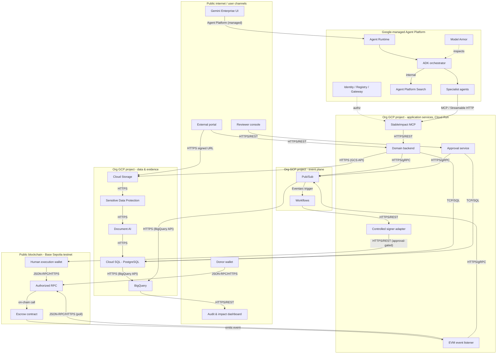

# Design Document: StableImpact

_Drafted 2026-08-28._

## Application Description

StableImpact is an agentic funding and impact-assurance platform for organizations that
manage grants, donations, corporate social responsibility programs, humanitarian
funding, or international development programs. Gemini-based agents structure funding
applications, review policy and evidence, assess risk, and recommend milestone-based
disbursements, but a human always makes the actual approval decision. Once a decision is
recorded, deterministic Google Cloud workflows execute it, and a Base Sepolia smart
contract provides a verifiable (testnet) record of the USDC contribution or release. The
platform's job is to connect funding decisions, evidence, approvals, payments,
reconciliation, and impact reporting into one traceable lifecycle, rather than leaving
them scattered across disconnected systems.

Several distinct kinds of users interact with the platform. **Beneficiary
organizations** (nonprofits, grantees) apply for funding, submitting organizational
documents, a budget, and an impact plan, and later submit evidence against individual
milestones. **Donors/funders** contribute test USDC to a campaign. **Business reviewers**
— authenticated humans — review the agents' risk and evidence recommendations and record
the actual approve/reject decision for both campaigns and disbursements; a separate
**execution wallet holder** signs the on-chain release itself, only after that decision
has passed deterministic validation, and is treated as a distinct piece of evidence even
when the same person holds both roles. **Auditors and operators** consume reconciliation
and impact reporting without acting inside the flow. Finally, the **Gemini/ADK agents**
themselves — an orchestrator plus specialists for compliance, matching, evidence/impact,
treasury, audit, and operations — are a distinct actor class: they read, recommend, and
explain, but they never approve, sign, or execute anything themselves.

## Architecture

### High-level system architecture

