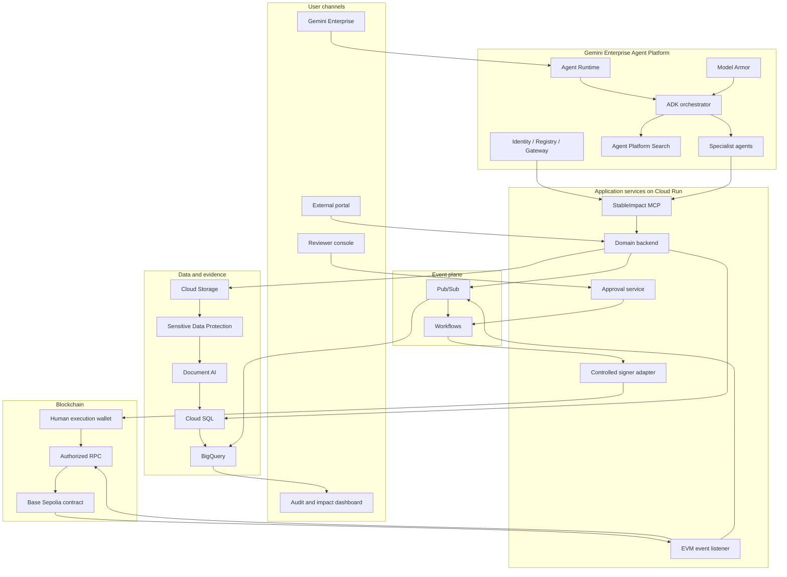

# StableImpact

## Agentic Global Funding and Impact Assurance on Google Cloud

**Team-sharing edition**

## 1. Executive summary

StableImpact is an agentic funding and impact-assurance platform for organizations that manage grants, donations, corporate social responsibility programs, humanitarian funding, or international development programs.

Gemini agents help structure applications, review policies and evidence, identify risks, and recommend milestone-based disbursements. Humans retain final authority. Deterministic Google Cloud workflows enforce the approved decision, while a Base Sepolia smart contract provides verifiable test-USDC contributions and releases.

StableImpact is not “Kickstarter with crypto.” It is an enterprise operating layer that connects funding decisions, evidence, approvals, payments, reconciliation, and impact reporting.

### Hackathon submission snapshot

| Field | Value |
|---|---|
| Project name | **StableImpact — Agentic Global Funding and Impact Assurance** |
| Description | StableImpact helps enterprises and nonprofits manage global funding programs. Gemini agents structure applications, review evidence, assess risk, and recommend milestone releases. Humans retain approval, while deterministic Google Cloud workflows and a Base Sepolia smart contract provide auditable test-USDC disbursements. |
| Industry | Financial Services, Philanthropy, Nonprofits, Enterprise Software |
| Challenge | **The Custom Agent Challenge — High-Code & MCP** |
| Keywords | `GeminiEnterpriseHack2026`, Agentic AI, Gemini Enterprise, Google ADK, MCP, Google Cloud, Stablecoins, USDC, Crowdfunding, Grants, Impact, Blockchain |
| Primary testnet | Base Sepolia |

---

## 2. Business problem

Organizations that manage grants, donations, international funding, or social-impact programs often operate through fragmented processes:

- Applications and documents are distributed across multiple systems.
- Eligibility and risk reviews are heavily manual.
- Payments are difficult to connect to verified results.
- Internal records and payment systems are reconciled separately.
- Donors, auditors, and program owners have limited end-to-end visibility.
- CRM, ERP, document, compliance, and financial integrations are expensive.
- Duplicate payments, inconsistent evidence, and incomplete approvals create operational risk.

StableImpact addresses this fragmentation with one traceable funding lifecycle:

1. Beneficiary organization onboarding.
2. Structured campaign or program creation.
3. Document, eligibility, and risk assessment.
4. Matching campaigns with suitable funding programs.
5. Test-stablecoin contributions.
6. Milestone evidence collection and analysis.
7. Agent-generated disbursement recommendation.
8. Authenticated human approval.
9. Deterministic blockchain execution.
10. Reconciliation, analytics, and impact reporting.

---

## 3. Real-world applications

### International grant management

Foundations and development agencies can onboard organizations, assess proposals, divide awards into milestones, review evidence, and maintain an auditable case file.

### Corporate social responsibility

Enterprises can run impact programs, connect employees or partners with projects, and show how each contribution relates to measurable outcomes.

### Nonprofit financing

Nonprofits can submit projects, budgets, documents, and milestone evidence through a guided experience that reduces administrative work.

### Humanitarian assistance

Programs can coordinate global disbursements using authenticated approvals, authorized wallets, sanctions controls, and verifiable records.

### Climate and community funds

Funding can be tied to indicators such as solar systems installed, water points activated, students served, or homes repaired.

### Open innovation programs

Companies and public entities can fund pilots, release resources against deliverables, and preserve the full decision history.

---

## 4. Primary hackathon story

An enterprise creates a global clean-water funding program in Gemini Enterprise. A nonprofit applies for funding and submits its organizational documents, budget, and impact plan.

StableImpact performs the following end-to-end flow:

1. Gemini interviews the nonprofit and structures the application.
2. Cloud Storage receives the source documents.
3. Sensitive Data Protection detects and redacts information that agents should not receive.
4. Document AI extracts structured fields and invoice data.
5. The compliance agent evaluates a versioned policy and cites its evidence.
6. An authenticated human approves the campaign.
7. A donor contributes test USDC on Base Sepolia.
8. An EVM listener in Cloud Run ingests the contract event into Pub/Sub.
9. The nonprofit submits evidence for the first milestone.
10. The evidence agent compares documents, budget, acceptance criteria, and blockchain data.
11. The agent recommends approval, rejection, or a request for more information.
12. An authenticated reviewer records the business decision.
13. Workflows validates deterministic rules and requests transaction simulation.
14. A separate human wallet signs the approved blockchain transaction.
15. The smart contract releases the approved test-USDC amount.
16. Cloud SQL, BigQuery, and the audit view reconcile the operation.
17. Gemini Enterprise generates an evidence-backed audit and impact explanation.

---

## 5. Challenge fit and differentiation

### Primary category

**The Custom Agent Challenge — High-Code & MCP**

### Technical differentiators

- Custom agents built with Google Agent Development Kit.
- Agent Runtime deployment and Gemini Enterprise registration.
- A private, domain-specific MCP server hosted on Cloud Run.
- Agent Identity, Agent Registry, and Agent Gateway when available.
- Model Armor and application-level controls against prompt injection.
- Document AI and Sensitive Data Protection for evidence processing.
- Cloud SQL as the operational source of truth.
- Pub/Sub, Eventarc, and Workflows for deterministic orchestration.
- Base Sepolia smart contract with verifiable test-USDC transactions.
- BigQuery reconciliation across operational and on-chain events.
- Explicit separation between AI reasoning, human authority, and payment execution.

### Product differentiators

- Every release is connected to evidence and an authenticated decision.
- Unstructured documents become explainable, reviewable recommendations.
- The human remains accountable for financial decisions.
- Existing enterprise systems can be integrated without exposing generic APIs to the model.
- Donors, operators, and auditors receive one traceable funding record.

---

## 6. Scope and reality of the demonstration

### Required real components

- Functional ADK agent.
- Agent Runtime and Gemini Enterprise registration.
- StableImpact MCP on private Cloud Run.
- Domain backend and approval service.
- Cloud SQL for PostgreSQL.
- Cloud Storage and Document AI.
- Sensitive Data Protection or an explicitly documented equivalent control.
- Pub/Sub and Workflows.
- Secret Manager.
- Cloud Logging and Trace.
- BigQuery.
- Base Sepolia smart contract.
- Verifiable contribution and disbursement transactions.
- Authenticated human approval.

### Conditional extensions

The following strengthen the submission but must not block the core flow:

- Agent Identity.
- Agent Registry.
- Agent Gateway.
- Memory Bank.
- Agent Platform Code Execution.
- Application Integration and Integration Connectors.
- Cloud KMS transaction signing.
- Blockchain Analytics.
- Looker Studio.
- Security Command Center.
- External KYC, KYB, sanctions, CRM, or ERP providers.

### Mock policy

Any simulated provider must:

- Preserve the target provider’s API contract.
- Produce reproducible positive, negative, and ambiguous outcomes.
- Be clearly labeled in the UI and documentation.
- Be replaceable without changing agent logic.
- Never be presented as a completed production integration.

### Critical hackathon path

The team must protect one complete vertical slice:

1. Create a campaign through Gemini Enterprise.
2. Process and sanitize evidence.
3. Persist the campaign, milestone, and approval.
4. Receive a Base Sepolia contribution.
5. Generate a grounded milestone recommendation.
6. Record an authenticated human decision.
7. Simulate and execute the release.
8. Ingest the on-chain event.
9. Reconcile and explain the complete operation.

### Production and regulatory boundary

The hackathon uses synthetic organizations, documents, wallets, and testnet assets only. A real-funds launch would require:

- Defined launch jurisdictions.
- Legal review covering crowdfunding, stablecoins, money transmission, consumer protection, tax, and privacy.
- Production KYC/KYB, sanctions screening, and risk-based AML controls.
- A custody and segregation-of-funds policy.
- Dispute, refund, recovery, and customer-support processes.
- Independent assessment of the smart contract and signing service.
- Incident response, continuity, and recovery controls.
- Explicit data retention and residency decisions.

The demo must describe these as adoption requirements and must not claim authorization to process real funds.

---

## 7. Google Cloud architecture

| Layer | Service | StableImpact use |
|---|---|---|
| Enterprise experience | Gemini Enterprise | Operator, reviewer, and analyst entry point |
| Agent development | Google ADK | Orchestrator, specialist agents, tools, callbacks, and state |
| Managed execution | Agent Runtime | Agent hosting |
| Agent state | Sessions | Conversational continuity without treating chat as a financial record |
| Knowledge | Agent Platform Search | Eligibility policies, review guidance, and approved program content |
| Agent governance | Agent Identity, Registry, Gateway | Identity, inventory, authorization, and policy enforcement |
| AI protection | Model Armor | Prompt, response, URL, and intermediate payload inspection |
| MCP and APIs | Cloud Run | StableImpact MCP, backend, listener, signer adapter, and integrations |
| Operational data | Cloud SQL for PostgreSQL | Campaigns, milestones, approvals, transactions, and internal ledger |
| Documents | Cloud Storage | Quarantine, originals, sanitized copies, and reports |
| Document intelligence | Document AI | OCR, forms, invoices, and structured extraction |
| Privacy | Sensitive Data Protection | PII detection, classification, and redaction |
| Events | Pub/Sub and Eventarc | Decoupled business, document, and blockchain events |
| Deterministic orchestration | Workflows | Post-approval validation and controlled execution |
| Secrets and cryptography | Secret Manager and Cloud KMS | Provider credentials and optional compatible signing |
| Analytics | BigQuery | Reconciliation, audit, impact, and agent analytics |
| Visualization | Looker Studio or BigQuery views | Program and impact reporting |
| Operations | Logging, Monitoring, Trace | Correlated diagnostics and alerts |
| Delivery | Artifact Registry and Cloud Build | Reproducible service artifacts |
| Infrastructure | Terraform | Reviewed, repeatable cloud resources and IAM |

### Target architecture



---

## 8. Responsibility boundaries

### Gemini and ADK

They may:

- Understand intent and collect missing information.
- Explain policies and results.
- Select authorized tools.
- Compare evidence against criteria.
- Generate recommendations and reports.

They may not:

- Approve campaigns or disbursements.
- Calculate the authoritative financial ledger.
- Grant permissions.
- Sign transactions.
- Modify the deployed contract.
- Treat model output as verified on-chain state.

### Domain backend

The backend owns:

- State machines and deterministic business rules.
- Amount validation and integer token units.
- Authorization and idempotency.
- Operational persistence.
- Append-only financial records.
- Reconciliation.

### Workflows

Workflows owns the deterministic path after a human decision:

- Validate approval, campaign, milestone, token, amount, recipient, and contract.
- Reject reused or mismatched approvals.
- Request transaction simulation.
- Invoke the configured execution mechanism.
- Persist the outcome and publish events.

### Human reviewer and execution wallet

The business reviewer authenticates through the reviewer console and records the decision. The execution wallet signs only after that decision passes deterministic validation. The reviewer identity and wallet address are separate evidence, even if one person controls both during the demo.

### Smart contract

The contract owns:

- Demonstration custody.
- Contribution accounting.
- Milestone release enforcement.
- Double-release prevention.
- Verifiable event emission.

---

## 9. Agent topology

### Orchestrator agent

Routes intent, delegates work, requests missing fields, maintains the user conversation, stops at human-decision boundaries, and produces a unified response.

### Program and campaign agent

Turns conversations and forms into structured campaigns, drafts milestones and impact indicators, searches approved policies, and saves drafts through MCP.

### Compliance and due-diligence agent

Reviews sanitized organization data, Document AI outputs, KYC/KYB or sanctions results, and a versioned risk matrix. It explains uncertainty and escalates ambiguous cases.

### Matching agent

Matches eligible campaigns with funding programs and explains mission alignment, expected impact, and risk. It avoids investment language or return promises.

### Evidence and impact agent

Compares milestone evidence with acceptance criteria, budget, invoices, and verified transactions. It produces a sourced recommendation but cannot change approval state.

### Treasury agent

Reads balances and transactions, prepares a disbursement proposal, explains amount, recipient, milestone, and conditions, and requests simulation. It cannot approve, sign, or execute.

### Audit agent

Reconciles Cloud SQL, contract events, BigQuery, and authorized blockchain data. It detects discrepancies and produces traceable explanations.

### Operations agent

Reads authorized metrics, traces, and errors; summarizes incidents without exposing secrets; and recommends actions without modifying infrastructure.

---

## 10. StableImpact MCP

StableImpact MCP is a private Streamable HTTP service on Cloud Run protected by IAM, OIDC, or Agent Gateway. It is the only authoritative agent interface for business operations.

### Campaign tools

- `campaign_create_draft`
- `campaign_get`
- `campaign_update_draft`
- `campaign_submit`
- `campaign_list_eligible`
- `campaign_get_policy_context`

### Organization and risk tools

- `organization_get`
- `organization_get_verification`
- `compliance_run_checks`
- `risk_get_policy`
- `risk_save_assessment`

### Evidence tools

- `evidence_create_upload`
- `evidence_get_processing_status`
- `evidence_get_extracted_fields`
- `evidence_get_sanitized_content`
- `milestone_save_agent_review`

### Read-only blockchain tools

- `chain_get_network`
- `chain_get_campaign_state`
- `chain_get_token_balance`
- `chain_get_transaction`
- `chain_list_contract_events`

### Controlled financial tools

- `contribution_prepare`
- `disbursement_create_proposal`
- `disbursement_simulate`
- `disbursement_execute_approved`
- `refund_prepare`

### Audit and operations tools

- `audit_get_campaign_ledger`
- `audit_compare_sources`
- `audit_get_trace`
- `audit_generate_dataset`
- `audit_save_report`
- `ops_get_agent_trace`
- `ops_get_service_health`
- `ops_get_failed_events`
- `ops_prepare_incident_report`

### MCP rules

- Strict JSON Schema and rejection of unknown fields.
- Authorization by tool, identity, and resource.
- Idempotency keys for writes.
- Structured, redacted, auditable responses.
- No arbitrary SQL or shell execution.
- No generic blockchain transaction method.
- No private-key access.
- No model access to `signMessage`, `sendTokens`, `writeContract`, `sendTransactions`, contract deployment, or equivalent tools.
- Third-party blockchain tools require an explicit per-agent allowlist.
- External blockchain results must be validated against the configured chain ID, token, and contract.
- External MCP failure must not block the core flow while the authorized RPC is available.

---

## 11. Operational flows

### Organization onboarding

1. Identity Platform or corporate identity authenticates the user.
2. The portal creates signed upload URLs.
3. Files enter a restricted Cloud Storage quarantine.
4. Sensitive Data Protection inspects the content.
5. Document AI extracts structured fields.
6. Pub/Sub emits `organization.documents.processed`.
7. Cloud SQL receives the normalized case file.
8. The compliance agent reads sanitized data.
9. Application Integration invokes real providers or labeled mocks.
10. A human reviewer decides the outcome.

### Campaign creation and approval

1. Gemini Enterprise collects campaign information.
2. Agent Platform Search retrieves relevant policy.
3. StableImpact MCP creates a draft.
4. The backend validates objectives, budget, milestones, and amounts.
5. Risk and campaign agents generate sourced recommendations.
6. The reviewer approves or requests changes.
7. The backend records the decision and emits `campaign.approved`.

### Test-USDC contribution

1. The portal displays network, token, contract, and amount.
2. The donor wallet signs the contribution.
3. The contract emits `ContributionReceived`.
4. The EVM listener confirms the chain, contract, event, and block.
5. Pub/Sub emits `contribution.confirmed`.
6. Cloud SQL records the contribution idempotently.
7. BigQuery receives the normalized event.

### Milestone evaluation

1. The organization uploads milestone evidence.
2. The document pipeline preserves the original and creates sanitized data.
3. The evidence agent retrieves the approved criteria.
4. It compares evidence, budget, invoices, and verified transactions.
5. It produces a sourced recommendation.
6. The backend creates a disbursement proposal.
7. The reviewer decides in the authenticated console.

### Disbursement

1. The approval service records the business decision.
2. Eventarc or Pub/Sub activates Workflows.
3. Workflows validates the unused approval, milestone, amount, recipient, token, and contract.
4. The backend or read-only provider simulates the transaction.
5. The human execution wallet signs the exact approved call.
6. The contract emits `FundsReleased`.
7. The listener records the transaction hash and receipt.
8. Cloud SQL and BigQuery reconcile the result.

### Reconciliation

The audit agent compares the internal ledger, contract events, approvals, contributions, releases, refunds, and balances. It records sourced findings and publishes an audit dataset to BigQuery.

---

## 12. Data architecture

### Cloud SQL for PostgreSQL

Cloud SQL is the operational source of truth for users, organizations, programs, campaigns, milestones, evidence, extracted fields, risk assessments, approvals, proposals, contributions, disbursements, blockchain events, audit events, and idempotency keys.

Required controls:

- Versioned migrations.
- Transactions around sensitive state changes.
- Unique constraints against duplicate actions.
- Append-only financial events.
- IAM database authentication and Cloud SQL Connector where supported.
- Private connectivity where available.

### Cloud Storage

Use separate buckets or prefixes for quarantine, originals, sanitized versions, Document AI outputs, reports, and demo artifacts. Enable uniform bucket-level access, versioning, signed uploads, managed encryption or approved CMEK, and no public access.

### BigQuery

Suggested datasets:

- `stableimpact_operational_events`
- `stableimpact_agent_traces`
- `stableimpact_blockchain_events`
- `stableimpact_impact_metrics`
- `stableimpact_audit_findings`

BigQuery supports analytics and reconciliation; it does not replace Cloud SQL.

### Search and memory

Agent Platform Search may index approved eligibility policies, review manuals, evidence templates, and public program documents. Sensitive content requires an explicit governance decision.

Memory Bank may store consented, non-sensitive preferences only. It must not store KYC data, financial decisions, private wallets, secrets, or authorizations.

---

## 13. Blockchain and blockchain MCP decision

### Selected network

**Base Sepolia** is the primary testnet.

| Resource | Selection |
|---|---|
| Network | Base Sepolia |
| Chain ID | `84532` |
| Gas token | Test ETH |
| Explorer | `https://sepolia-explorer.base.org` |
| Local-development public RPC | `https://sepolia.base.org` |
| Deployed-service RPC | Dedicated endpoint from an organization-approved provider |
| Stablecoin | Official Circle test USDC |
| Test-USDC contract | `0x036CbD53842c5426634e7929541eC2318f3dCF7e` |
| Deployment wallet | Dedicated testnet-only EVM account |
| Execution wallet | Separate human-controlled EVM wallet |
| Event ingestion | EVM listener to Pub/Sub, Cloud SQL, and BigQuery |

Base Sepolia keeps Solidity, OpenZeppelin, Foundry or Hardhat, EVM wallets, and USDC tooling simple. The public RPC is rate-limited and is not the deployed-service dependency.

### Alternatives

| Network | Assessment |
|---|---|
| Ethereum Sepolia | Primary fallback if Base gas, test USDC, or stable RPC access is unavailable |
| Polygon Amoy | Future EVM alternative if the production Polygon analytics story becomes more valuable |
| Arbitrum Sepolia | Reserve EVM option without a decisive MVP advantage |
| Hedera Testnet | Strong native MCP and Google ADK story, but requires adapting token, wallet, and integration semantics |
| Stellar Testnet | Strong global-payments narrative and Raven MCP data access, but requires a different contract and asset stack |
| Solana Devnet | Strong stablecoin ecosystem, but non-EVM and its official developer MCP does not execute financial transactions |

### Blockchain MCP selection

| MCP or toolkit | Decision |
|---|---|
| StableImpact MCP | Required and authoritative |
| Alchemy MCP | Optional read-only events, receipts, traces, and simulation for the audit agent |
| Coinbase AgentKit MCP | Optional isolated accelerator for Base Sepolia development; never an autonomous signer |
| thirdweb MCP | Prototype fallback only because of its broad transactional surface and project-secret handling |
| Hedera Agent Kit MCP | Reference for a future Hedera variant |
| Stellar Raven MCP | Research and live-data queries, not financial execution |
| Solana Developer MCP | Documentation and program analysis, not financial execution |
| QuickNode MCP | Infrastructure administration only; on-chain access still uses RPC or another data service |

Alchemy MCP must use OAuth and a read-only allowlist equivalent to:

- `ethChainId`
- `ethGetBalance`
- `ethGetTransactionByHash`
- `ethGetTransactionReceipt`
- `ethGetLogs`
- `ethCall`
- `ethEstimateGas`

Smart wallets and submission tools remain disabled.

### Wallet separation

At least two testnet wallets are required:

1. **Deployment wallet:** deploys contracts and assigns initial roles.
2. **Execution wallet:** signs an exact release after authenticated business approval.

The corporate reviewer identity is not replaced by a wallet address. Approval and signing are distinct, correlated events. No personal wallet is reused, no wallet contains real assets, and no seed phrase or private key enters Git, prompts, logs, databases, analytics, or agent memory.

### Test tokens

Use documented Base or CDP faucets for test ETH and test USDC. Verify addresses against official sources before deployment. Testnet USDC has no financial value and is not backed by real dollars.

If official test USDC cannot be obtained, deploy a clearly labeled six-decimal `MockUSDC` with restricted minting. Do not add bridges, swaps, yield, or upgrade machinery.

---

## 14. Smart contract

### Purpose

Hold test USDC for approved campaigns and release milestone amounts under explicit roles and invariants.

### Minimum functions

- Register a campaign.
- Deposit tokens.
- Read campaign balance.
- Configure milestones and amounts.
- Release an approved milestone.
- Pause operations.
- Cancel under explicit rules.
- Refund when allowed.

### Roles

- `ADMIN_ROLE`
- `CAMPAIGN_MANAGER_ROLE`
- `DISBURSEMENT_EXECUTOR_ROLE`
- `PAUSER_ROLE`

### Events

- `CampaignRegistered`
- `ContributionReceived`
- `MilestoneConfigured`
- `MilestoneApproved`
- `FundsReleased`
- `RefundIssued`
- `CampaignCancelled`
- `ContractPaused`
- `ContractUnpaused`

### Invariants

- A milestone cannot be released twice.
- Released plus refunded amounts cannot exceed deposits.
- The released amount must match the approved milestone.
- Only the authorized role may execute a release.
- Paused campaigns cannot release funds.
- A failed token transfer cannot produce successful state.
- Events contain immutable identifiers required for reconciliation.

### Signing

The base hackathon path uses the human Base Sepolia execution wallet. Cloud KMS with `EC_SIGN_SECP256K1_SHA256` is optional only after validating end-to-end EVM transaction construction and signing with the selected libraries.

In every mode:

- The agent never receives the private key.
- MCP exposes no generic signing method.
- A valid authenticated approval is mandatory.
- Chain ID, contract, token, amount, recipient, and calldata are validated.

---

## 15. Enterprise integrations

Application Integration and approved connectors may synchronize campaigns with a CRM, create beneficiaries in an ERP, route reviews, invoke KYC/KYB or sanctions services, transform schemas, and publish events.

Integration rules:

- Agents never call enterprise systems with shared credentials.
- Cloud Run or Application Integration handles authentication and transformation.
- MCP exposes domain actions rather than generic vendor APIs.
- Every external write includes idempotency and audit evidence.
- At least one real enterprise integration should be visible in the demo.

---

## 16. Security and governance

### Identity and access

- One service identity per component.
- Least-privilege IAM.
- Private Cloud Run by default.
- Separate deployment and runtime access.
- Human approval for IAM changes.
- Agent Identity, Registry, and Gateway when enabled.

### AI and document security

- Model Armor for prompt injection, jailbreaks, malicious URLs, PII, and supported intermediate payloads.
- Application callbacks or MCP middleware when platform-level coverage is incomplete.
- File quarantine, type allowlists, size limits, and malware inspection before Document AI.
- Sensitive Data Protection before agent consumption.
- Sanitized evaluation datasets.

### Secrets

- Secret Manager for RPC, OAuth, webhook, and provider credentials.
- No versioned secret files.
- No secrets in prompts, logs, datasets, traces, or evaluation results.
- Sensitive MCP URLs and OAuth parameters must be redacted.

### Application controls

- Restrictive CORS.
- Correct token audience.
- Replay protection.
- Idempotency.
- Schema validation.
- Append-only audit records.
- Cloud Armor where endpoints are public.

---

## 17. Observability and analytics

Every operation correlates:

- `trace_id`
- `session_id`
- `agent_run_id`
- `user_id`
- `organization_id`
- `campaign_id`
- `milestone_id`
- `approval_id`
- `workflow_execution_id`
- `transaction_hash`

Logging records selected agent, invoked tool, structured result, security rejection, state change, approval event, transaction, and reconciliation outcome. Full prompts and documents are excluded unless an approved policy states otherwise.

Trace propagates through Gemini Enterprise, Agent Runtime, MCP, backend, integrations, Workflows, the signer adapter, and event listener.

Monitoring covers completed runs, tool errors, authorization rejections, evidence outcomes, proposals, approvals, failed transactions, reconciliation discrepancies, and Model Armor findings.

---

## 18. Minimum data model

Core entities:

- `User`
- `Organization`
- `FundingProgram`
- `Campaign`
- `Milestone`
- `Evidence`
- `DocumentExtraction`
- `RiskAssessment`
- `Contribution`
- `Approval`
- `DisbursementProposal`
- `Disbursement`
- `BlockchainEvent`
- `ImpactMetric`
- `AuditEvent`
- `AgentRun`
- `IntegrationEvent`

Rules:

- Financial records use immutable identifiers.
- Token amounts use integer base units.
- Approvals are single-use.
- Financial events are append-only.
- Backend validates every state transition.
- On-chain data includes chain ID, token, contract, block, and transaction hash.
- Model outputs preserve model ID, prompt version, sources, and trace ID.
- Documents preserve hashes of original and sanitized versions.

---

## 19. Repository structure

Preserve the official `agents-cli` scaffold, including evaluation, CI, and deployment files.

```text
stableimpact/
├── .agents-cli-spec.md
├── AGENTS.md
├── README.md
├── pyproject.toml
├── agent/
│   ├── prompts/
│   ├── subagents/
│   ├── tools/
│   ├── callbacks/
│   └── policies/
├── mcp_server/
│   ├── tools/
│   ├── schemas/
│   ├── auth/
│   └── middleware/
├── backend/
│   ├── api/
│   ├── domain/
│   ├── services/
│   ├── repositories/
│   └── events/
├── document_pipeline/
├── blockchain/
│   ├── contracts/
│   ├── tests/
│   ├── adapter/
│   └── deployments/
├── integrations/
├── web/
│   ├── public_portal/
│   └── reviewer_console/
├── workflows/
├── analytics/
├── evals/
├── tests/
│   ├── unit/
│   ├── integration/
│   ├── security/
│   └── end_to_end/
├── infra/
│   ├── terraform/
│   └── cloudbuild/
├── docs/
│   ├── architecture.md
│   ├── threat-model.md
│   ├── data-model.md
│   ├── mcp-contracts.md
│   ├── agent-design.md
│   ├── demo-script.md
│   ├── business-case.md
│   └── operations-runbook.md
└── status/
    ├── STATUS.md
    ├── DECISIONS.md
    ├── RISKS.md
    ├── RESOURCES.md
    └── TRACEABILITY.md
```

---

## 20. Configuration

### Non-sensitive variables

```text
GOOGLE_CLOUD_PROJECT
GOOGLE_CLOUD_LOCATION
GEMINI_MODEL
GEMINI_ENTERPRISE_APP_ID
AGENT_RUNTIME_RESOURCE
AGENT_REGISTRY_LOCATION
MODEL_ARMOR_TEMPLATE
AGENT_SEARCH_DATASTORE
CLOUD_SQL_INSTANCE
CLOUD_SQL_DATABASE
EVIDENCE_BUCKET
SANITIZED_EVIDENCE_BUCKET
BIGQUERY_DATASET
PUBSUB_TOPIC_PREFIX
MCP_SERVER_URL
MCP_AUTH_AUDIENCE
WORKFLOW_NAME
BLOCKCHAIN_RPC_URL_REFERENCE
BLOCKCHAIN_NETWORK
BLOCKCHAIN_CHAIN_ID
BLOCKCHAIN_EXPLORER_URL
ESCROW_CONTRACT_ADDRESS
TEST_USDC_ADDRESS
TEST_USDC_DECIMALS
BLOCKCHAIN_CONFIRMATIONS
BLOCKCHAIN_DATA_PROVIDER
BLOCKCHAIN_MCP_PROVIDER
BLOCKCHAIN_MCP_URL
BLOCKCHAIN_MCP_MODE
BLOCKCHAIN_MCP_TOOL_ALLOWLIST
COINBASE_AGENTKIT_ENABLED
SIGNER_MODE
KYC_MODE
SANCTIONS_MODE
ENVIRONMENT
```

### Initial blockchain values

```text
BLOCKCHAIN_NETWORK=base-sepolia
BLOCKCHAIN_CHAIN_ID=84532
BLOCKCHAIN_EXPLORER_URL=https://sepolia-explorer.base.org
TEST_USDC_ADDRESS=0x036CbD53842c5426634e7929541eC2318f3dCF7e
TEST_USDC_DECIMALS=6
BLOCKCHAIN_DATA_PROVIDER=dedicated_rpc
BLOCKCHAIN_MCP_PROVIDER=alchemy
BLOCKCHAIN_MCP_URL=https://mcp.alchemy.com/mcp
BLOCKCHAIN_MCP_MODE=read_only
BLOCKCHAIN_MCP_TOOL_ALLOWLIST=ethChainId,ethGetBalance,ethGetTransactionByHash,ethGetTransactionReceipt,ethGetLogs,ethCall,ethEstimateGas
COINBASE_AGENTKIT_ENABLED=false
SIGNER_MODE=human_wallet
```

The RPC setting stores a Secret Manager reference, never a credential-bearing URL. OAuth secrets, RPC credentials, webhook secrets, external-provider credentials, and signer configuration remain in Secret Manager or the approved managed equivalent.

---

## 21. Dependency-driven execution roadmap

The AI execution agent follows each phase in order and cannot advance until its exit criteria are satisfied.

### Phase 0 — Resource discovery

Actions:

- Inspect repository instructions and run `agents-cli info`.
- Inventory APIs, quotas, regions, identities, permissions, and hackathon resources.
- Verify Gemini Enterprise, Agent Platform, Cloud Run, data, security, event, integration, and evaluation services.
- Verify Base Sepolia, chain ID, explorer, approved RPC, faucet assets, test USDC, deployment wallet, and execution wallet.
- Classify external blockchain MCP access as read-only, restricted write, or prohibited.
- Record every service as Available, Pending, Unavailable, or Fallback Defined.

Exit:

- No hidden assumptions.
- Every component has a decision and fallback.
- Missing permissions are documented.

### Phase 1 — Business specification

Actions:

- Create or update `.agents-cli-spec.md`.
- Define internal and external users.
- Select the primary real-world case.
- Define eligibility, risk, approval, retention, and sensitive-data policies.
- Select the real enterprise integration.
- Define the happy path and expected failures.
- Obtain human approval of the specification.

Exit:

- A specific business problem and ownership model are approved.

### Phase 2 — Official patterns

Actions:

- Review official ADK samples and relevant Google reference implementations.
- Study full-stack MCP, OAuth, safety, grounded search, and Agent Platform Search patterns.
- Record adopted patterns in `status/DECISIONS.md`.

Exit:

- Every reference has a concrete design conclusion.

### Phase 3 — Cloud foundation

Actions:

- Define Terraform resources.
- Enable approved APIs.
- Create separated service accounts and least-privilege IAM.
- Configure Artifact Registry, Cloud Build, buckets, datasets, and empty Secret Manager entries.
- Request approval before creating cloud resources.

Exit:

- Infrastructure is reproducible, identities are separated, and no secret is versioned.

### Phase 4 — Agent scaffold

Actions:

- Use the official `agents-cli scaffold`.
- Preserve evaluation, CI, and deployment boilerplate.
- Configure Agent Runtime as the target where available.
- Synchronize dependencies with `uv`.
- Run the base agent.

Exit:

- `agents-cli info` recognizes the project and the base agent runs locally.

### Phase 5 — Domain data and state machine

Actions:

- Implement the data model and Cloud SQL migrations.
- Implement append-only ledger events, states, transitions, idempotency, and uniqueness constraints.
- Add deterministic unit tests.

Exit:

- Invalid states, reused approvals, and duplicate disbursements are rejected.

### Phase 6 — Document pipeline

Actions:

- Implement signed uploads and quarantine.
- Add Sensitive Data Protection and Document AI.
- Store structured results and hashes.
- Publish document events.
- Test valid, incomplete, and malicious documents.

Exit:

- Agents consume sanitized content with complete traceability.

### Phase 7 — Blockchain and controlled signing

Actions:

- Configure Base Sepolia and validate chain ID on every operation.
- Implement and test the USDC escrow contract.
- Use official test USDC or clearly labeled `MockUSDC`.
- Test roles, amounts, pause, reentrancy, refunds, and double release.
- Implement dedicated RPC access and the EVM event listener.
- Integrate Alchemy MCP only if approved and read-only.
- Evaluate Coinbase AgentKit MCP in isolation and leave it disabled unless it adds visible value.
- Use a separate deployment and execution wallet.
- Request approval before contract deployment or any transaction.
- Verify the contract and record addresses, roles, and hashes.

Exit:

- Contract and transactions are reproducible and externally verifiable.
- The core path survives auxiliary MCP failure.
- The agent has no key access.

### Phase 8 — Backend and Workflows

Actions:

- Implement campaign, evidence, approval, ledger, and audit APIs.
- Implement the approval service and disbursement Workflow.
- Connect Pub/Sub and Eventarc.
- Add simulation and the controlled signer adapter.
- Test approval, RPC, signer, and contract failures.

Exit:

- A valid approval is mandatory and retries cannot duplicate transactions.

### Phase 9 — MCP server

Actions:

- Implement domain tools and deploy Streamable HTTP MCP on Cloud Run.
- Configure IAM, OIDC, or Agent Gateway.
- Apply strict schemas and granular authorization.
- Register tools when Agent Registry is available.
- Connect read-only Alchemy MCP to the audit agent only.
- Block and test external signing, token transfer, deployment, and contract-write tools.
- Redact OAuth, credentials, tokens, and sensitive URLs.

Exit:

- MCP is private, authenticated, least-privileged, and cannot bypass approval.

### Phase 10 — ADK agents

Actions:

- Implement orchestrator and specialist agents.
- Assign minimum tools per agent.
- Add tracing, security, and audit callbacks.
- Integrate approved search, sessions, memory, and sandboxed code execution.
- Run local smoke tests.

Exit:

- Delegation is correct, sources are cited, and autonomous financial actions are rejected.

### Phase 11 — Enterprise integration

Actions:

- Configure Application Integration or an approved connector.
- Implement real KYC/KYB, sanctions, CRM, ERP, Drive, or equivalent integration where available.
- Keep mocks contract-compatible and labeled.
- Add transformation, idempotency, and audit evidence.

Exit:

- At least one real enterprise integration is visible.

### Phase 12 — User channels

Actions:

- Register and test the agent in Gemini Enterprise.
- Implement the authenticated external portal and reviewer console.
- Display evidence, risk, amount, recipient, token, contract, and network before approval.
- Display verifiable transaction links.

Exit:

- Operators, external users, and reviewers have distinct authenticated experiences.

### Phase 13 — Analytics and observability

Actions:

- Build BigQuery datasets and views.
- Join operational and blockchain events.
- Build the audit and impact view.
- Configure Logging, Trace, Monitoring, correlation, and alerts.

Exit:

- The full operation is traceable and logs contain no sensitive data.

### Phase 14 — Security and threat model

Actions:

- Create `docs/threat-model.md`.
- Test prompt injection, tool authorization, replay, duplicates, wrong chain, wrong contract, and malicious documents.
- Review IAM, secrets, buckets, contract, signer adapter, and evaluation data.
- Review Model Armor and Security Command Center findings where available.

Exit:

- Critical threats are mitigated, no secrets are versioned, and no payment path bypasses human approval.

### Phase 15 — Tests and agent evaluation

Actions:

- Use pytest for deterministic code.
- Use `agents-cli eval` for agent behavior.
- Evaluate tool choice, grounding, policy adherence, and security.
- Add regression cases and preserve results.

Required cases include valid and invalid campaigns, missing data, manipulated evidence, prompt injection, nonexistent transactions, mismatched or reused approvals, duplicate release, wrong network or contract, unavailable RPC, reconciliation differences, secret requests, and financial-return promises.

Thresholds:

- Zero payments without valid approval.
- Zero exposed secrets.
- Zero duplicate releases.
- All sensitive actions audited.
- Correct tool selection in at least 90% of primary cases.
- Grounded responses in at least 90% of evaluable cases.
- All critical dataset attacks rejected.

Exit:

- Thresholds pass, critical regressions are absent, and limitations are documented.

### Phase 16 — Deployment and publication

Actions:

- Review infrastructure, permissions, configuration, and evaluation evidence.
- Obtain human approval.
- Deploy the agent, MCP, backend, listener, portal, workflows, and analytics.
- Run deployed smoke tests.
- Obtain human approval before publishing.
- Register the agent in Gemini Enterprise and verify the complete experience.

Exit:

- Approved components are deployed and the critical path works on real hackathon resources.

### Phase 17 — Demonstration evidence

Actions:

- Create one complete synthetic campaign.
- Prepare safe documents, invoices, evidence, wallets, and test tokens.
- Create `docs/demo-script.md` and `docs/business-case.md`.
- Capture architecture, agent registration, traces, Workflows, BigQuery, and transaction evidence.
- Prepare controlled fallbacks and reproducible instructions.

Exit:

- Judges can see agents, MCP, Google Cloud, authenticated human authority, blockchain verification, and a credible enterprise adoption path.

---

## 22. Demonstration script

1. Show an unstructured campaign and fragmented documents.
2. Create the structured campaign through Gemini Enterprise.
3. Show agent delegation and MCP tool calls.
4. Show the original file, sanitization result, and Document AI extraction.
5. Show persisted state in Cloud SQL and events in Pub/Sub.
6. Show the milestone recommendation with sources and uncertainty.
7. Show the authenticated reviewer decision.
8. Show Workflows validating and simulating the exact release.
9. Sign with the human execution wallet.
10. Show the transaction hash, contract event, and balance change.
11. Ask Gemini:

> Why was this payment released, who approved it, which evidence supported it, and where can I verify the transaction?

12. Show the BigQuery audit record and impact view.

---

## 23. Success metrics

### Business

- Share of releases associated with accepted evidence.
- Share of campaigns with complete case files.
- Reconciliation coverage.
- Funding distribution by program, region, and category.
- Impact-indicator coverage.
- Discrepancies detected before closure.

### Operations

- Completed agent runs.
- Correct tool calls.
- Policy-rejected actions.
- Events processed without duplicates.
- Reconciliation incidents.
- Approvals with complete traceability.

### Security

- Blocked prompt-injection attempts.
- Detected PII findings.
- IAM-rejected MCP calls.
- Release attempts without approval.
- Secrets detected in code or logs.

---

## 24. Controlled fallbacks

| Unavailable component | Fallback | Evidence to preserve |
|---|---|---|
| Agent Identity | Dedicated least-privilege service account | Permission matrix |
| Agent Gateway | Cloud Run IAM/OIDC and policy middleware | Authorization tests |
| Agent Registry | Gemini registration and documented local catalog | Agent and tool inventory |
| Agent Platform Search | Approved managed RAG or controlled application corpus | Sources and evaluations |
| Application Integration | Cloud Run REST adapter | Equivalent contract |
| External enterprise provider | Reproducible OpenAPI mock | Payloads and labeled scenarios |
| Cloud KMS signing | Human testnet execution wallet | Approval and transaction hash |
| Blockchain Analytics testnet coverage | First-party event ingestion | BigQuery event table |
| Alchemy MCP | Backend RPC adapter | Normalized responses and reconciliation tests |
| Coinbase AgentKit MCP | First-party EVM adapter | Simulation, approval, and hash |
| External MCP OAuth incompatibility | Approved server-to-server API or RPC | Authentication matrix and traces |
| Dedicated RPC | Public Base Sepolia RPC for demonstration only | Health and error evidence |
| Test-USDC faucet | Minimal six-decimal `MockUSDC` | Verified code and clear mock label |
| Base Sepolia | Ethereum Sepolia with official test USDC | Recorded network decision |
| Looker Studio | BigQuery queries and views | Verifiable results |

---

## 25. Definition of Done

StableImpact is complete when:

- The ADK agent runs in Agent Runtime and appears in Gemini Enterprise.
- StableImpact MCP is private, authenticated, and deployed on Cloud Run.
- External blockchain MCP tools are read-only or simulation-only and explicitly allowlisted.
- Tests prove that signing and contract-write tools are blocked from agents.
- At least one real enterprise integration is active.
- The document pipeline processes the synthetic case with traceability.
- Cloud SQL preserves authoritative state and the internal ledger.
- Pub/Sub and Workflows participate in the release flow.
- An authenticated human approval exists.
- The smart contract receives test USDC and releases one milestone.
- Deployment and execution wallets are separate and contain no real assets.
- Contract, token, transactions, and events are verifiable in the explorer.
- The agent has no private-key access.
- BigQuery contains operational and blockchain evidence.
- End-to-end traces connect agent, tool, approval, Workflow, and transaction.
- Evaluation thresholds pass.
- No secret appears in the repository, logs, traces, or datasets.
- Documentation distinguishes real components, mocks, fallbacks, and production requirements.
- The demonstration connects the technical implementation to enterprise adoption.

---

## 26. Team responsibilities

The project benefits from clear human ownership even though an AI agent executes the implementation plan.

### Product and business owner

- Owns the primary use case, user roles, business policy, and demo story.
- Approves scope and acceptance criteria.

### Google Cloud and agent owner

- Provides the Google Cloud project and validates available hackathon resources.
- Owns ADK, Agent Runtime, Gemini Enterprise registration, IAM, and MCP deployment decisions.

### Blockchain and smart-contract owner

- Creates the testnet-only deployment and execution wallets.
- Obtains faucet assets.
- Reviews contract roles, invariants, and deployment evidence.
- Performs human transaction approvals and signatures.

### Data, integration, and compliance owner

- Defines synthetic evidence, risk rules, KYC/KYB or sanctions behavior, enterprise integration, retention, and privacy controls.

### Demo and evidence owner

- Maintains the reproducible scenario, audit question, screenshots, fallback material, and final presentation narrative.

No team member shares seed phrases or private keys with the agent, repository, chat, or another team member.

---

## 27. Rules for the AI execution agent

The agent may autonomously read and modify in-scope local files, run local tests and evaluations, create synthetic data, prepare unapplied Terraform, analyze already-authorized logs, fix local errors, and maintain status documentation.

Human approval is required before:

- Installing unapproved dependencies.
- Enabling APIs.
- Creating or deleting cloud resources.
- Changing IAM.
- Accessing secrets.
- Sending data to an external provider.
- Deploying a service or contract.
- Executing a blockchain transaction.
- Publishing the agent.
- Creating external cost.
- Changing scope.

Operational rules:

- Execute phases in order.
- Do not advance without satisfying the current exit criteria.
- Preserve unrelated code and configuration.
- Do not change the configured model without authorization.
- Verify available models before creating an agent.
- Use the official scaffold before agent implementation.
- Keep deterministic pytest tests separate from agent evaluations.
- Fix regressions before adding capabilities.
- Stop repeated retries after the same failure occurs three times and document the blocker.
- Record decisions, risks, resources, status, and traceability.

---

## 28. Execution-agent starting prompt

```text
Read stableimpact-roadmap-google-cloud-enterprise-en.md completely and use it as the source of truth.

Build StableImpact as a demonstrable enterprise application on Google Cloud. Do not reduce it to a chatbot, visual mockup, or collection of simulated services. Protect the critical vertical path through Gemini Enterprise, ADK, Agent Runtime, private MCP on Cloud Run, Cloud SQL, Cloud Storage, Document AI, Pub/Sub, Workflows, BigQuery, authenticated human approval, and a verifiable Base Sepolia transaction.

Execute the phases in order. Do not advance until the current exit criteria are satisfied. Keep STATUS.md, DECISIONS.md, RISKS.md, RESOURCES.md, and TRACEABILITY.md current.

Before writing agent code, inspect available resources, create or validate .agents-cli-spec.md, study the official patterns, and use the official agents-cli scaffold.

Work autonomously only on local, reversible, in-scope actions. Request human approval immediately before enabling APIs, creating cloud resources, modifying permissions, accessing secrets, deploying, publishing, transmitting external data, or executing blockchain transactions.

Never use assets with financial value. Never request or store a private key. Agents may analyze and recommend, but they may not approve or sign disbursements. Financial rules are deterministic and the decision belongs to an authenticated person.

StableImpact MCP is the only authoritative interface for business operations. Treat external blockchain MCP servers as auxiliary read or simulation sources. Never expose generic signing, transfer, deployment, or contract-write tools to the model.

Use documented fallbacks without hiding the difference between the target service and the fallback.

Begin with Phase 0.
```

---

## 29. Official references

- [Gemini Enterprise Agent Platform overview](https://docs.cloud.google.com/gemini-enterprise-agent-platform/overview)
- [Build with Gemini Enterprise Agent Platform](https://docs.cloud.google.com/gemini-enterprise-agent-platform/build)
- [Agents and platform architecture](https://docs.cloud.google.com/gemini-enterprise-agent-platform/agents)
- [Agent Runtime with ADK](https://docs.cloud.google.com/gemini-enterprise-agent-platform/build/runtime/quickstart-adk)
- [Register ADK agents in Gemini Enterprise](https://docs.cloud.google.com/gemini/enterprise/docs/register-and-manage-an-adk-agent)
- [Agent Registry](https://docs.cloud.google.com/agent-registry/overview)
- [Agent Gateway](https://docs.cloud.google.com/gemini-enterprise-agent-platform/govern/gateways/agent-gateway-overview)
- [Host MCP servers on Cloud Run](https://docs.cloud.google.com/run/docs/host-mcp-servers)
- [Application Integration](https://docs.cloud.google.com/application-integration/docs/overview)
- [Document AI processors](https://docs.cloud.google.com/document-ai/docs/processors-list)
- [Model Armor](https://docs.cloud.google.com/model-armor/overview)
- [Sensitive Data Protection](https://docs.cloud.google.com/sensitive-data-protection/docs/sensitive-data-protection-overview)
- [Cloud SQL IAM authentication](https://docs.cloud.google.com/sql/docs/postgres/iam-authentication)
- [Workflows triggered by Pub/Sub and Eventarc](https://docs.cloud.google.com/workflows/docs/trigger-workflow-eventarc)
- [Cloud KMS algorithms](https://docs.cloud.google.com/kms/docs/algorithms)
- [Blockchain Analytics](https://docs.cloud.google.com/blockchain-analytics/docs)
- [Base network parameters](https://docs.base.org/base-chain/quickstart/connecting-to-base)
- [Base explorers](https://docs.base.org/get-started/block-explorers)
- [Circle USDC contract addresses](https://developers.circle.com/stablecoins/usdc-contract-addresses)
- [Circle test-USDC EVM transfer](https://developers.circle.com/stablecoins/quickstarts/transfer-usdc-evm)
- [Circle Gateway supported blockchains](https://developers.circle.com/gateway/references/supported-blockchains)
- [Ethereum development networks](https://ethereum.org/developers/docs/networks/)
- [Polygon RPC endpoints](https://docs.polygon.technology/pos/reference/rpc-endpoints/)
- [Polygon faucets](https://docs.polygon.technology/tools/gas/matic-faucet/)
- [Google Cloud Blockchain Analytics supported datasets](https://docs.cloud.google.com/blockchain-analytics/docs/supported-datasets)
- [Coinbase AgentKit MCP extension](https://github.com/coinbase/agentkit/blob/main/typescript/framework-extensions/model-context-protocol/README.md)
- [Coinbase AgentKit networks and frameworks](https://docs.cdp.coinbase.com/agent-kit/core-concepts/frameworks)
- [Coinbase Developer Platform faucets](https://docs.cdp.coinbase.com/faucets/introduction/welcome)
- [Alchemy MCP Server](https://www.alchemy.com/docs/alchemy-mcp-server)
- [thirdweb MCP Server](https://portal.thirdweb.com/ai/mcp)
- [thirdweb EVM chain support](https://portal.thirdweb.com/typescript/v5/chain)
- [Hedera Agent Kit MCP and Google ADK](https://hedera.com/blog/hedera-agent-kit-v4-policies-modular-packages-and-plugin-updates/)
- [Stellar Raven MCP](https://developers.stellar.org/docs/build/building-with-ai)
- [Solana Developer MCP](https://mcp.solana.com/)
- [QuickNode MCP](https://www.quicknode.com/docs/build-with-ai/quicknode-mcp)
